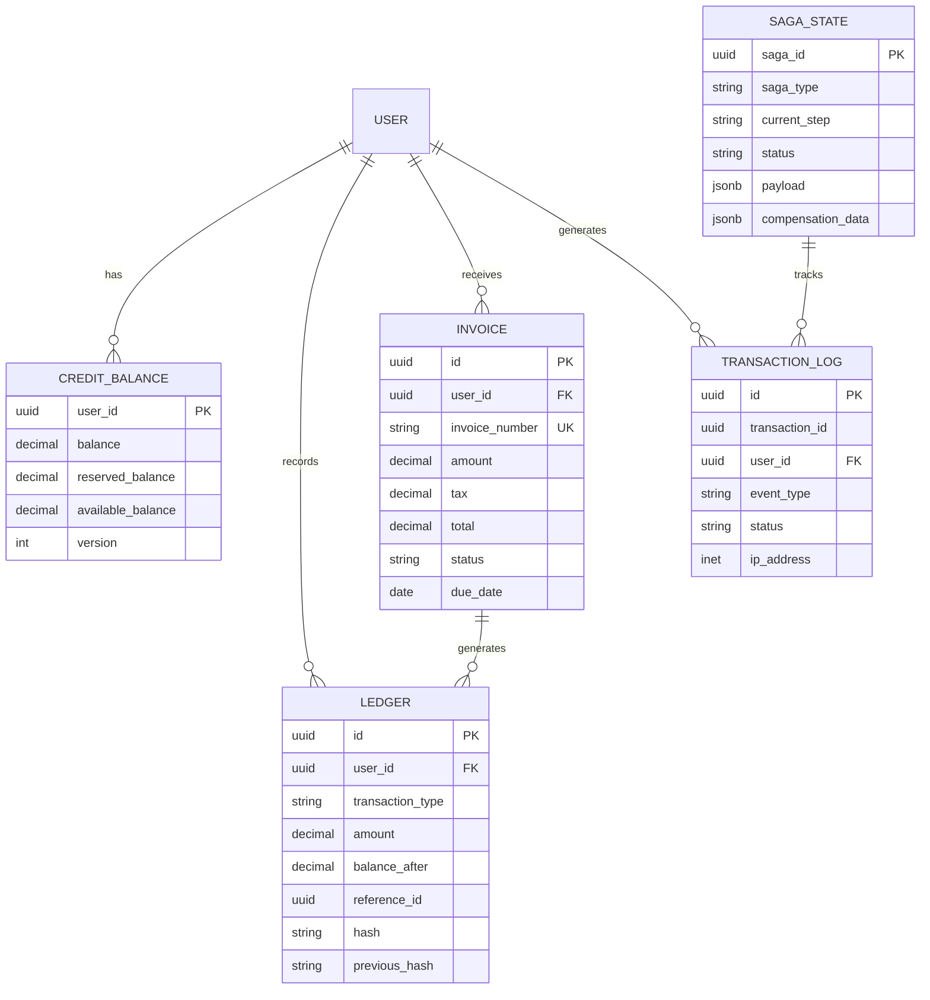

## User Input

```text
$ARGUMENTS
```

**Patterns:**
- NEW: "Create SPEC for payment system..."
- EDIT: `specs/feature/spec-004/spec.md`
- With profile: `--profile=financial`
- With mode: `--mode=compact`
- With flags: `--no-di --security=stride-basic`

---

## 0. Parse Command-Line Flags (NEW v5.0)

### 0.1 Profile Selection

```
--profile=<type>

Options:
  basic           - Minimal SPEC (Overview, Architecture, API/Data)
  backend-service - Standard backend (DI, testing, monitoring)
  financial       - Full security + performance (STRIDE, SLA, metrics)
  full            - All sections (default - v4.0 compatibility)
```

### 0.2 Mode Selection

```
--mode=<type>

Options:
  standard - Full SPEC with all details (default)
  compact  - Condensed 5-section SPEC for simple projects
```

### 0.3 Security Level

```
--security=<level>

Options:
  none         - No security section
  basic        - Basic security considerations
  stride-basic - STRIDE table (5-10 lines, key threats only)
  stride-full  - Complete STRIDE model (100+ lines, detailed)
  auto         - Auto-detect based on profile (default)
```

### 0.4 DI Pattern Control

```
--di=<level>

Options:
  full    - Complete DI pattern documentation (default for backend)
  minimal - Brief DI pattern mention
  none    - No DI pattern section
  auto    - Auto-detect based on project type (default)

Shorthand:
  --no-di  - Same as --di=none
```

### 0.5 Performance Requirements Control

```
--performance=<level>

Options:
  full    - Complete performance requirements
  basic   - Key metrics only (P99, TPS, uptime)
  none    - No performance section
  auto    - Auto-detect based on profile/domain (default)
```

### 0.6 Force Update Critical Sections

```
--force-update=<sections>

Options:
  all                          - Allow update all critical sections
  stride,config,di            - Allow specific sections
  none                        - Preserve all critical sections (default)
```

### 0.7 Output Organization

```
--no-backup        - Don't create backup files
--no-report        - Don't generate reports
--output-dir=<dir> - Custom output directory (default: .smartspec/)
```

### 0.8 Validation

```
--validate-consistency  - Check consistency between sections
--no-validation        - Skip validation checks
```

### 0.9 Domain Hints (NEW)

```
--domain=<type>

Options:
  healthcare - Real-time + privacy critical
  iot        - High throughput, telemetry
  logistics  - High SLA requirements
  ai         - Latency sensitive
  fintech    - Security + performance critical
  saas       - Scalability focused
  internal   - Lower requirements
```

---

## 1. Load SmartSpec Context

Read configuration in priority order:
1. `smartspec.config.json` (if exists - project-specific)
2. `.smartspec/config.json` (if exists - organization-wide)
3. `.smartspec/SPEC_INDEX.json` (if exists - for dependency resolution)
4. Built-in defaults

Parse flags from $ARGUMENTS and merge with config.

### 1.1 Load SPEC_INDEX.json for Dependency Resolution

If `.smartspec/SPEC_INDEX.json` exists:
- Load the entire spec index into memory
- This will be used to resolve spec dependencies with full path and repo information
- Structure: `{ "specs": [{ "id": "...", "title": "...", "path": "...", "repo": "..." }] }`

If file doesn't exist:
- Dependencies will be listed without path/repo information
- Show warning in output

---

## 2. Determine SPEC Structure (Profile-Based)

### 2.1 Profile: basic

**Sections:**
1. Header (minimal)
2. Overview (Purpose, Scope, Features)
3. Architecture Summary (high-level only)
4. API Specification OR Data Model (choose one)
5. Acceptance Criteria

**Excludes:**
- When to Use
- Detailed Implementation Guide
- Testing Strategy
- Monitoring
- Security (unless --security specified)
- Performance Requirements
- DI Pattern

**Use Cases:**
- Simple CRUD services
- Internal tools
- Prototypes
- Documentation-first projects

---

### 2.2 Profile: backend-service

**Sections:**
1. Header
2. Technology Stack
3. Dependency Injection Pattern (if --di≠none)
4. Overview
5. When to Use
6. Architecture
7. Implementation Guide (core steps)
8. Testing Requirements
9. Monitoring (basic metrics)
10. Examples

**Includes if detected:**
- Configuration Schema (if config mentioned)
- API Documentation (if REST/GraphQL)
- Database Schema (if DB mentioned)

**Excludes by default:**
- STRIDE Model (add with --security)
- Detailed Performance Requirements (add with --performance)

**Use Cases:**
- Standard microservices
- API services
- Backend workers
- Most backend projects

---

### 2.3 Profile: financial

**Sections (Full Critical System):**
1. Header
2. Technology Stack
3. Dependency Injection Pattern (MANDATORY)
4. Overview
5. When to Use / When NOT to Use
6. Architecture (detailed)
7. **Data Model & Schema** - Database schema, ER diagram (NEW)
8. **Security Threat Model (STRIDE)** - Full by default
9. **Performance Requirements** - Full metrics
10. **Configuration Schema** - Complete
11. Implementation Guide
12. Testing Strategy (comprehensive)
13. Monitoring & Observability (detailed)
14. Examples (multiple scenarios)
15. Related Specs

**Automatically includes:**
- ✅ Data Model & Schema (tables, ER diagram)
- ✅ STRIDE threat model (full)
- ✅ Performance Requirements (P50/P95/P99, TPS, SLA)
- ✅ Audit logging requirements
- ✅ Idempotency requirements
- ✅ Data integrity checks
- ✅ Disaster recovery
- ✅ Compliance notes

**Use Cases:**
- Payment systems
- Credit/billing systems
- Financial transactions
- Any system handling money

---

### 2.4 Profile: full (default)

**All v4.0 sections** - backward compatible

Same as current SmartSpec v4.0 behavior:
- Auto-detect Performance Requirements
- Auto-detect DI Pattern
- Auto-detect Security needs
- Include all optional sections

---

## 3. Mode Handling

### 3.1 Mode: standard (default)

Full detail for each section as per profile.

### 3.2 Mode: compact

**Condense to 5 core sections:**

```markdown
# SPEC-XXX: [Title]

**Status:** DRAFT
**Profile:** [Profile used]
**Mode:** COMPACT

---

## 1. Overview

**Purpose:** [One sentence]
**Scope:** [Key features list]
**Non-Goals:** [What's excluded]

---

## 2. Architecture Summary

**Pattern:** [e.g., REST API + PostgreSQL + Redis]
**Components:** [List major components]
**Data Flow:** [Simple diagram or description]

---

## 3. Technical Specification

### 3.1 API Endpoints (if applicable)

| Method | Endpoint | Purpose |
|--------|----------|---------|
| GET | /api/v1/... | ... |
| POST | /api/v1/... | ... |

### 3.2 Data Model (if applicable)

**Key Entities:**
- Entity1: [Fields]
- Entity2: [Fields]

---

## 4. Constraints & Risk Notes

**Performance:**
- [Key constraint if applicable]

**Security:**
- [Key risk if applicable]

**Technical Debt:**
- [Known limitations]

---

## 5. Acceptance Tests

- [ ] Functional test 1
- [ ] Functional test 2
- [ ] Integration test
- [ ] Performance acceptable
- [ ] Security baseline met

---
```

**When to use compact mode:**
- Simple projects
- Internal tools
- Rapid prototyping
- When detailed SPEC is overkill

---

## 4. Security Level Handling

### 4.1 security=none

No security section included.

### 4.2 security=basic

```markdown
## Security Considerations

**Authentication:** [Method]
**Authorization:** [Approach]
**Data Protection:** [Encryption, sanitization]
**Key Risks:** [2-3 bullet points]

---
```

### 4.3 security=stride-basic

```markdown
## Security Threat Model (STRIDE-Basic)

| Threat | Risk | Mitigation |
|--------|------|------------|
| **Spoofing** | User impersonation | JWT + MFA |
| **Tampering** | Data modification | TLS + signatures |
| **Information Disclosure** | Data leaks | Encryption + access controls |
| **Denial of Service** | Unavailability | Rate limiting + scaling |

**Implementation:**
- [2-3 key security requirements]

---
```

### 4.4 security=stride-full

Full STRIDE model as in v4.0:
- Complete threat table (6 categories)
- Detailed mitigation strategies
- Implementation requirements
- Testing approach
- Compliance notes

**Enhanced for Fintech/Financial Domain:**

When `--domain=fintech` or `--profile=financial`, include additional security measures:

```markdown
## Security Threat Model (STRIDE-Full)

### Spoofing
- **JWT Validation:** Verify signature, expiration, issuer
- **API Key Rotation:** Automatic rotation every 90 days
- **MFA for Sensitive Operations:** Required for financial transactions > threshold
- **Device Fingerprinting:** Track and verify known devices

### Tampering
- **Ledger Tamper-Proof Design:**
  - Immutable ledger entries (no UPDATE/DELETE)
  - SHA-256 hash chain (blockchain-style)
  - Audit log integrity verification
  - Previous hash linkage for tamper detection
- **Request Signing:** HMAC-SHA256 for API requests
- **HTTPS/TLS Enforcement:** TLS 1.3 minimum
- **Database Constraints:** CHECK constraints prevent invalid states

### Repudiation
- **Comprehensive Audit Trail:**
  - All financial operations logged
  - IP address, user agent, request ID tracking
  - Timestamp with timezone (UTC)
  - Non-repudiation signatures for critical operations
- **Immutable Logs:** Append-only transaction log
- **7-Year Retention:** Compliance requirement

### Information Disclosure
- **Encryption at Rest:** AES-256 for sensitive data
- **Encryption in Transit:** TLS 1.3
- **PII Masking in Logs:** Credit card, SSN, account numbers masked
- **Secure Key Management:** AWS KMS / HashiCorp Vault
- **Data Classification:** PUBLIC, INTERNAL, CONFIDENTIAL, RESTRICTED

### Denial of Service
- **Rate Limiting:**
  - Per user: 100 req/min
  - Per IP: 1000 req/min
  - Per endpoint: Custom limits
- **Replay Attack Mitigation:**
  - Idempotency key required for mutations
  - Request timestamp validation (max 5 min skew)
  - Nonce-based replay prevention
  - Idempotency key expiration (24 hours)
- **Circuit Breaker Pattern:** Prevent cascade failures
- **Request Timeout:** 30s max
- **Connection Pooling:** Limit concurrent connections

### Elevation of Privilege
- **RBAC Enforcement:** Role-based access control
- **Principle of Least Privilege:** Minimal permissions
- **TOCTOU Race Condition Prevention:**
  - Optimistic locking (version field)
  - Database-level constraints
  - Transaction isolation level: SERIALIZABLE for critical operations
  - Row-level locking for balance updates
- **Credit Double-Spending Prevention:**
  - Atomic balance updates (BEGIN TRANSACTION)
  - Reserved balance mechanism
  - Distributed lock for critical operations (Redis)
  - Idempotency checks before deduction
- **Admin Action Audit:** All admin operations logged

### Saga-Specific Security (NEW)
- **Multi-Service Reconciliation:**
  - Saga state verification across services
  - Compensation idempotency (can retry safely)
  - Cross-service audit trail
  - Saga timeout detection (max 5 minutes)
- **Saga Timeout Handling:**
  - Automatic compensation on timeout
  - Dead letter queue for failed sagas
  - Manual intervention dashboard
- **Saga Replay Protection:**
  - Saga ID uniqueness check
  - Step completion verification
  - Prevent duplicate saga execution

### Financial-Specific Threats (NEW)

#### Double-Spending Attack
- **Prevention:**
  - Optimistic locking on credit_balance table
  - Check available balance before deduction
  - Reserve balance during pending operations
  - Atomic commit after all checks pass

#### Ledger Tampering
- **Prevention:**
  - Immutable ledger (no UPDATE/DELETE)
  - Hash chain verification
  - Periodic integrity checks
  - Alert on hash mismatch

#### Transaction Replay
- **Prevention:**
  - Idempotency key required
  - Request timestamp validation
  - Nonce tracking (Redis)
  - Duplicate detection within 24h window

#### Unauthorized Refunds
- **Prevention:**
  - Refund authorization workflow
  - Admin approval for refunds > threshold
  - Refund reason required
  - Audit trail for all refunds

### Compliance Requirements
- **PCI DSS Level 1:** If processing credit cards
- **SOC 2 Type II:** Security controls audit
- **GDPR:** If handling EU customer data
- **Data Residency:** Store data in approved regions

### Security Testing
- **Penetration Testing:** Annual third-party audit
- **Vulnerability Scanning:** Weekly automated scans
- **Dependency Audits:** Daily npm/pip audit
- **OWASP Top 10:** Coverage in test suite
- **Chaos Engineering:** Test failure scenarios
```

---

## 5. DI Pattern Handling

### 5.1 di=none or --no-di

Skip DI Pattern section entirely.

### 5.2 di=minimal

```markdown
## Dependency Injection

This service uses constructor-based dependency injection.

**Example:**
```typescript
export class ServiceName {
  constructor(database?, logger?) {
    this.database = database || createDefault();
    this.logger = logger || createDefault();
  }
}
```

**Testing:** Inject mocks via constructor for unit tests.

---
```

### 5.3 di=full (default for backend)

Complete DI Pattern section as in v4.0:
- Core requirements
- Interface-based dependencies
- Testing requirements
- Benefits
- Complete examples

---

## 6. Performance Requirements Handling

### 6.1 performance=none

Skip performance section.

### 6.2 performance=basic

```markdown
## Performance Requirements

**Latency:** P99 < [threshold]
**Throughput:** [X] TPS sustained
**Availability:** [X]% uptime

---
```

### 6.3 performance=full (default for financial)

Complete performance section as in v4.0:
- P50/P90/P95/P99 targets
- Throughput capacity (normal + peak)
- SLA requirements
- Database performance
- Queue/worker baselines
- Metrics & alerting
- Load testing requirements

**Enhanced: Service-Level Performance Breakdown**

For multi-service architectures (especially financial systems), include per-service performance targets:

```markdown
## Performance Requirements

### System-Wide Targets

**Latency:**
- P50: < 100ms
- P95: < 200ms
- P99: < 300ms

**Throughput:**
- Normal load: 1000 TPS
- Peak load: 3000 TPS

**Availability:**
- SLA: 99.95% uptime
- Max downtime: 4.38 hours/year

**Scalability:**
- Horizontal scaling: Auto-scale based on CPU > 70%
- Max instances: 20

---

### Per-Service Performance Targets

#### Credit Service

**Latency:**
- P50: < 50ms
- P95: < 100ms
- P99: < 150ms

**Throughput:**
- Target: 1000 TPS
- Peak: 2000 TPS

**Workload Characteristics:**
- High-frequency reads (balance queries)
- Medium-frequency writes (credit add/deduct)
- Critical path: User-facing operations

**Database:**
- Read queries: < 10ms (P95)
- Write queries: < 20ms (P95)
- Connection pool: 20-50 connections

**Caching:**
- Cache hit rate: > 80%
- Cache TTL: 60 seconds for balance
- Cache invalidation: On balance update

---

#### Payment Service

**Latency:**
- P50: < 100ms
- P95: < 200ms
- P99: < 300ms
- P99.9: < 500ms (includes external API calls)

**Throughput:**
- Target: 500 TPS
- Peak: 1000 TPS

**Workload Characteristics:**
- Low-frequency, high-value transactions
- External API dependency (Stripe, PromptPay)
- Retry logic for failed payments

**External API:**
- Stripe API timeout: 10s
- Retry attempts: 3
- Circuit breaker: Open after 5 failures

**Database:**
- Transaction isolation: SERIALIZABLE
- Lock timeout: 5s

---

#### Billing Service

**Latency:**
- P50: < 200ms
- P95: < 500ms
- P99: < 1000ms

**Throughput:**
- Target: 100 TPS
- Peak: 300 TPS

**Workload Characteristics:**
- Batch processing (invoice generation)
- Scheduled jobs (monthly billing cycles)
- Complex calculations (tax, proration)

**Batch Jobs:**
- Invoice generation: < 5 minutes for 10K users
- Billing cycle: < 30 minutes for 100K users

**Database:**
- Bulk insert: 1000 records/second
- Report queries: < 5s

---

#### Cost Management Service

**Latency:**
- P50: < 100ms
- P95: < 200ms
- P99: < 300ms

**Throughput:**
- Target: 200 TPS
- Peak: 500 TPS

**Workload Characteristics:**
- Analytics queries (cost reports)
- Aggregations (daily/monthly summaries)
- Real-time cost tracking

**Database:**
- Aggregation queries: < 2s
- Time-series data: Partitioned by month
- Materialized views: Refreshed every 5 minutes

**Caching:**
- Report cache: 5 minutes TTL
- Summary cache: 15 minutes TTL

---

### Database Performance

**PostgreSQL:**
- Connection pool: 50-100 connections per service
- Query timeout: 30s
- Statement timeout: 10s
- Idle transaction timeout: 60s

**Read Replicas:**
- 2 read replicas for read-heavy services
- Replication lag: < 1s

**Indexes:**
- All foreign keys indexed
- Composite indexes for common queries
- Partial indexes for filtered queries

**Monitoring:**
- Slow query log: > 100ms
- Long-running queries: > 5s
- Deadlock detection: Alert immediately

---

### Queue Performance

**Message Queue (Redis/RabbitMQ):**
- Message processing: < 100ms per message
- Queue depth: Alert if > 1000 messages
- Consumer lag: < 10 seconds

**Dead Letter Queue:**
- Max retries: 3
- Retry backoff: Exponential (1s, 5s, 30s)

---

### Monitoring & Alerting

**Metrics Collection:**
- Interval: 10 seconds
- Retention: 30 days (high-res), 1 year (aggregated)

**Alerts:**
- P99 latency > 500ms: Warning
- P99 latency > 1000ms: Critical
- Error rate > 1%: Warning
- Error rate > 5%: Critical
- Availability < 99.9%: Critical

---

### Load Testing Requirements

**Scenarios:**
1. **Normal Load:** 1000 TPS for 1 hour
2. **Peak Load:** 3000 TPS for 15 minutes
3. **Stress Test:** Increase until failure
4. **Endurance Test:** 1000 TPS for 24 hours
5. **Spike Test:** 0 → 5000 TPS in 10 seconds

**Acceptance Criteria:**
- All P99 targets met under normal load
- No errors under normal load
- Graceful degradation under peak load
- System recovers within 5 minutes after spike
```

**Customization:**
- Adjust service names based on SPEC context
- Add/remove services as needed
- Modify targets based on business requirements
- Include domain-specific workload characteristics

---

## 7. Domain-Based Enhancement

If `--domain` specified, adjust sections:

### 7.1 domain=healthcare

Auto-add:
- Privacy & HIPAA compliance notes
- Real-time requirements
- Audit logging (mandatory)
- Data retention policies

### 7.2 domain=iot

Auto-add:
- High throughput expectations
- Telemetry patterns
- Edge computing considerations
- Batch processing requirements

### 7.3 domain=logistics

Auto-add:
- High SLA requirements (99.9%+)
- Geographic distribution
- Real-time tracking needs
- Integration complexity

### 7.4 domain=ai

Auto-add:
- Latency sensitivity
- Model versioning
- Inference performance
- GPU/compute requirements

### 7.5 domain=fintech

Same as `--profile=financial`

**Additional Saga Patterns for Fintech:**

Automatically include comprehensive saga orchestration patterns:

```markdown
## Saga Orchestration Patterns

### 1. Credit Purchase Saga

**Flow:**
```
1. Reserve Credit → 2. Process Payment → 3. Commit Credit → 4. Update Ledger
```

**Compensation:**
```
4. Rollback Ledger ← 3. Rollback Credit ← 2. Refund Payment ← 1. Release Reserve
```

**Implementation:**
```typescript
class CreditPurchaseSaga {
  async execute(amount: number, userId: string, paymentMethod: string) {
    const sagaId = generateSagaId();
    
    try {
      // Step 1: Reserve credit
      await creditService.reserve(userId, amount, sagaId);
      
      // Step 2: Process payment
      const paymentId = await paymentService.charge(paymentMethod, amount, sagaId);
      
      // Step 3: Commit credit
      await creditService.commit(userId, amount, sagaId);
      
      // Step 4: Update ledger
      await ledgerService.record(userId, 'CREDIT', amount, paymentId);
      
      await sagaService.markCompleted(sagaId);
    } catch (error) {
      await this.compensate(sagaId, error);
      throw error;
    }
  }
  
  async compensate(sagaId: string, error: Error) {
    const saga = await sagaService.getState(sagaId);
    
    // Rollback in reverse order
    if (saga.currentStep >= 4) await ledgerService.rollback(sagaId);
    if (saga.currentStep >= 3) await creditService.rollback(sagaId);
    if (saga.currentStep >= 2) await paymentService.refund(saga.paymentId);
    if (saga.currentStep >= 1) await creditService.releaseReserve(sagaId);
    
    await sagaService.markCompensated(sagaId, error.message);
  }
}
```

### 2. Cost Deduction Saga

**Flow:**
```
1. Check Balance → 2. Reserve Credit → 3. Deduct Credit → 4. Update Ledger → 5. Execute Service
```

**Compensation:**
```
5. Rollback Service ← 4. Rollback Ledger ← 3. Restore Credit ← 2. Release Reserve
```

### 3. Refund Saga (NEW)

**Flow:**
```
1. Validate Refund → 2. Process Refund → 3. Add Credit → 4. Update Ledger → 5. Notify User
```

**Compensation:**
```
5. Cancel Notification ← 4. Rollback Ledger ← 3. Deduct Credit ← 2. Reverse Refund
```

**Types:**
- **Full Refund:** Refund entire transaction amount
- **Partial Refund:** Refund portion of transaction
- **Refund Compensation:** Handle failed refund attempts

**Implementation:**
```typescript
class RefundSaga {
  async execute(transactionId: string, amount: number, reason: string) {
    const sagaId = generateSagaId();
    
    try {
      // Step 1: Validate refund eligibility
      const transaction = await validateRefund(transactionId, amount);
      
      // Step 2: Process refund via payment provider
      const refundId = await paymentService.refund(transaction.paymentId, amount);
      
      // Step 3: Add credit back to user
      await creditService.add(transaction.userId, amount, sagaId);
      
      // Step 4: Update ledger
      await ledgerService.record(transaction.userId, 'REFUND', amount, refundId);
      
      // Step 5: Notify user
      await notificationService.send(transaction.userId, 'refund_completed', { amount });
      
      await sagaService.markCompleted(sagaId);
    } catch (error) {
      await this.compensate(sagaId, error);
      throw error;
    }
  }
}
```

### 4. Failed Payment Compensation Saga (NEW)

**Scenario:** Payment fails after credit was reserved

**Flow:**
```
1. Detect Payment Failure → 2. Release Reserved Credit → 3. Update Status → 4. Retry Logic
```

**Retry Strategy:**
- **Attempt 1:** Immediate retry
- **Attempt 2:** Retry after 5 seconds
- **Attempt 3:** Retry after 30 seconds
- **After 3 failures:** Move to dead letter queue, notify admin

**Implementation:**
```typescript
class FailedPaymentCompensationSaga {
  async execute(sagaId: string, retryCount: number = 0) {
    const saga = await sagaService.getState(sagaId);
    
    try {
      // Release reserved credit
      await creditService.releaseReserve(saga.userId, saga.amount, sagaId);
      
      // Update saga status
      await sagaService.updateStatus(sagaId, 'COMPENSATED');
      
      // Notify user of failure
      await notificationService.send(saga.userId, 'payment_failed', {
        amount: saga.amount,
        reason: saga.errorMessage
      });
      
    } catch (error) {
      if (retryCount < 3) {
        await this.scheduleRetry(sagaId, retryCount + 1);
      } else {
        await deadLetterQueue.add(sagaId, error);
        await alertService.notifyAdmin('saga_compensation_failed', { sagaId });
      }
    }
  }
}
```

### 5. Partial Apply Scenario (NEW)

**Scenario:** User has insufficient credit, apply partial amount

**Flow:**
```
1. Check Available Balance → 2. Calculate Partial Amount → 3. Apply Partial → 4. Create Debt Record
```

**Implementation:**
```typescript
class PartialApplySaga {
  async execute(userId: string, requestedAmount: number, serviceId: string) {
    const balance = await creditService.getBalance(userId);
    
    if (balance.available >= requestedAmount) {
      // Full deduction
      return await costDeductionSaga.execute(userId, requestedAmount, serviceId);
    } else if (balance.available > 0) {
      // Partial deduction
      const partialAmount = balance.available;
      const remainingAmount = requestedAmount - partialAmount;
      
      await creditService.deduct(userId, partialAmount, sagaId);
      await debtService.create(userId, remainingAmount, serviceId);
      await ledgerService.record(userId, 'PARTIAL_DEBIT', partialAmount, serviceId);
      
      return { applied: partialAmount, debt: remainingAmount };
    } else {
      throw new InsufficientCreditError('No credit available');
    }
  }
}
```

### 6. Idempotent Replay Flow (NEW)

**Purpose:** Ensure saga can be safely replayed without side effects

**Idempotency Key:**
```typescript
interface SagaRequest {
  idempotencyKey: string; // Client-provided unique key
  userId: string;
  amount: number;
  // ... other fields
}
```

**Implementation:**
```typescript
class IdempotentSagaExecutor {
  async execute(request: SagaRequest) {
    // Check if already processed
    const existing = await sagaService.findByIdempotencyKey(request.idempotencyKey);
    
    if (existing) {
      if (existing.status === 'COMPLETED') {
        // Return cached result
        return existing.result;
      } else if (existing.status === 'PENDING') {
        // Wait for completion
        return await this.waitForCompletion(existing.sagaId);
      } else if (existing.status === 'FAILED') {
        // Return cached error
        throw new Error(existing.errorMessage);
      }
    }
    
    // Create new saga with idempotency key
    const sagaId = await sagaService.create({
      idempotencyKey: request.idempotencyKey,
      type: 'CREDIT_PURCHASE',
      payload: request
    });
    
    // Execute saga
    return await this.executeSaga(sagaId, request);
  }
}
```

**Duplicate Request Detection:**
```typescript
// Redis-based duplicate detection
const isDuplicate = await redis.set(
  `idempotency:${idempotencyKey}`,
  sagaId,
  'EX', 86400, // 24 hour expiration
  'NX' // Only set if not exists
);

if (!isDuplicate) {
  const existingSagaId = await redis.get(`idempotency:${idempotencyKey}`);
  return await sagaService.getResult(existingSagaId);
}
```

### Saga Best Practices

1. **Idempotency:** All saga steps must be idempotent
2. **Timeout:** Set maximum saga execution time (5 minutes)
3. **Compensation:** Always implement compensation logic
4. **State Persistence:** Store saga state in database
5. **Monitoring:** Track saga success/failure rates
6. **Dead Letter Queue:** Handle permanently failed sagas
7. **Retry Logic:** Exponential backoff for transient failures
8. **Audit Trail:** Log all saga state transitions
```

### 7.6 domain=internal

Reduce requirements:
- Lower SLA expectations
- Simpler security
- Minimal performance tracking

---

## 8. Meta Tags for Critical Sections

### 8.1 Insert Meta Tags

For critical sections, add meta tags:

```markdown
<!-- @critical security -->
## Security Threat Model (STRIDE)
...
<!-- @end-critical -->

<!-- @critical config -->
## Configuration Schema
...
<!-- @end-critical -->

<!-- @critical di -->
## Dependency Injection Pattern
...
<!-- @end-critical -->

<!-- @critical monitoring -->
## Monitoring & Observability
...
<!-- @end-critical -->
```

### 8.2 Benefits

- Precise identification (no keyword guessing)
- Easier restoration
- Clear boundaries
- Allow selective updates with --force-update

---

## 9. Force Update Handling (EDIT mode)

### 9.1 Default Behavior

Preserve all critical sections (v4.0 behavior).

### 9.2 With --force-update=all

Allow updating ANY critical section without restoration.

### 9.3 With --force-update=stride,config

Allow updating ONLY specified sections:
- stride → STRIDE threat model
- config → Configuration schema
- di → DI pattern
- monitoring → Monitoring section

Other critical sections still preserved.

### 9.4 Meta Tag Override

```markdown
<!-- @critical security allow-update -->
## Security Threat Model
...
<!-- @end-critical -->
```

This section can be updated even without --force-update flag.

---

## 10. Consistency Validation (NEW)

If `--validate-consistency` specified:

### 10.1 Check Consistency Rules

**Rule 1: API in Architecture → Must appear in Examples**
```
FOR each API endpoint in Architecture:
  IF NOT found in Examples:
    WARN: "API {endpoint} defined but no example provided"
```

**Rule 2: Queue mentioned → Must have Queue metrics**
```
IF Architecture mentions "queue" OR "worker":
  IF Performance Requirements missing queue metrics:
    ERROR: "Queue mentioned but no queue performance metrics"
```

**Rule 3: Database transactions → Must have Integration Tests**
```
IF mentions "transaction" OR "ACID":
  IF Testing section lacks integration tests:
    WARN: "Transactions mentioned but no integration tests defined"
```

**Rule 4: External API → Must have Retry Policy**
```
IF mentions "external API" OR "third-party":
  IF Implementation Guide lacks retry/backoff:
    WARN: "External API mentioned but no retry policy defined"
```

**Rule 5: Authentication → Must have Security Section**
```
IF mentions "auth" OR "login" OR "JWT":
  IF no Security section:
    ERROR: "Authentication mentioned but no security section"
```

### 10.2 Report Consistency Issues

```
🔍 Consistency Check Results:

❌ ERROR: Authentication mentioned but no security section
⚠️  WARN: API /api/v1/users defined but no example provided
⚠️  WARN: Queue mentioned but no queue performance metrics
✅ PASS: All critical sections present
✅ PASS: Examples cover main features

Summary: 2 errors, 2 warnings, 10 checks passed
```

If errors found and `--validate-consistency` specified:
- Display report
- Ask user to fix or continue anyway

---

## 11. Output Organization (NEW)

### 11.1 Default Structure

```
.smartspec/
├── backups/
│   └── spec-004-financial-system/
│       ├── spec.backup-20251203-1430.md
│       └── spec.backup-20251203-1445.md
├── reports/
│   └── spec-004-financial-system/
│       ├── generation-report-20251203.md
│       └── validation-report-20251203.md
├── registry/
│   └── critical-sections-registry.json
├── config.json
└── trace.log
```

### 11.2 With --no-backup

Skip backups/ directory creation.

### 11.3 With --no-report

Skip reports/ directory creation.

### 11.4 With --output-dir=custom/path

Use custom directory instead of .smartspec/

---

## 12. Configuration File Support (NEW)

### 12.1 smartspec.config.json

```json
{
  "version": "5.0.0",
  "defaults": {
    "profile": "backend-service",
    "mode": "standard",
    "security": "auto",
    "di": "auto",
    "performance": "auto"
  },
  "organization": {
    "name": "Company Name",
    "defaultAuthor": "SmartSpec Architect v5.0"
  },
  "profiles": {
    "backend-service": {
      "includeSections": ["di", "testing", "monitoring"],
      "excludeSections": ["stride-full"],
      "security": "basic",
      "performance": "basic"
    },
    "financial": {
      "includeSections": ["stride-full", "performance-full", "audit"],
      "security": "stride-full",
      "performance": "full",
      "mandatory": ["di", "security", "performance"]
    }
  },
  "domains": {
    "healthcare": {
      "autoInclude": ["privacy", "audit", "realtime"],
      "compliance": ["HIPAA"],
      "performance": "full"
    },
    "iot": {
      "autoInclude": ["throughput", "telemetry"],
      "performance": "full"
    }
  },
  "validation": {
    "enabled": true,
    "rules": {
      "api-example-coverage": "warn",
      "queue-metrics": "error",
      "external-api-retry": "warn"
    }
  },
  "output": {
    "createBackups": true,
    "generateReports": true,
    "outputDir": ".smartspec/"
  }
}
```

### 12.2 Config Priority

1. Command-line flags (highest)
2. Project config (smartspec.config.json)
3. Organization config (.smartspec/config.json)
4. Built-in defaults (lowest)

---

## 13. Generate SPEC Based on Profile & Flags

### 13.1 Assemble Sections

Based on:
- Selected profile
- Flags (--security, --di, --performance)
- Domain hints
- Config file settings

### 13.1.1 Resolve Spec Dependencies (NEW)

If the SPEC includes dependencies (Related Specs section):

1. **Extract dependency IDs** from user input or existing SPEC
2. **Look up each dependency** in SPEC_INDEX.json
3. **Format each dependency** as:
   ```
   - **{spec_id}** - {description} - Spec Path: "{path}/spec.md" Repo: {repo}
   ```
4. **Group by category**:
   - Core Dependencies (category: "core")
   - Feature Specs (category: "feature")
   - Infrastructure Specs (category: "infrastructure")

**Example output:**
```markdown
## 19. Related Specs

### 19.1. Core Dependencies
- **spec-core-001-authentication** - User authentication for financial operations - Spec Path: "specs/core/spec-core-001-authentication/spec.md" Repo: private
- **spec-core-002-authorization** - RBAC for admin financial operations - Spec Path: "specs/core/spec-core-002-authorization/spec.md" Repo: private

### 19.2. Feature Specs
- **spec-002-user-management** - User profile and account management - Spec Path: "specs/feature/spec-002-user-management/spec.md" Repo: public
```

**Error handling:**
- If spec not found in SPEC_INDEX.json:
  ```
  - **spec-unknown-001** - [NOT FOUND IN SPEC_INDEX] - Spec Path: "N/A" Repo: unknown
  ```
- If SPEC_INDEX.json doesn't exist:
  ```
  ⚠️ Warning: SPEC_INDEX.json not found. Dependencies listed without path/repo information.
  
  ## 19. Related Specs
  - **spec-core-001-authentication** - User authentication for financial operations
  ```

### 13.1.2 Generate Data Model Section (NEW - Financial Profile Only)

If profile is `financial`, automatically include Data Model & Schema section:

**Section Structure:**
```markdown
## {N}. Data Model & Schema

### {N}.1 Core Tables

#### Ledger Table
```sql
CREATE TABLE ledger (
  id UUID PRIMARY KEY DEFAULT gen_random_uuid(),
  user_id UUID NOT NULL,
  transaction_type VARCHAR(50) NOT NULL, -- CREDIT, DEBIT, REFUND
  amount DECIMAL(19,4) NOT NULL,
  balance_after DECIMAL(19,4) NOT NULL,
  reference_id UUID, -- Link to payment/invoice/transaction
  description TEXT,
  metadata JSONB,
  created_at TIMESTAMP NOT NULL DEFAULT NOW(),
  created_by UUID NOT NULL,
  
  -- Immutability & Tamper Detection
  is_immutable BOOLEAN DEFAULT TRUE,
  hash VARCHAR(64), -- SHA-256 for tamper detection
  previous_hash VARCHAR(64), -- Link to previous entry (blockchain-style)
  
  -- Indexes
  INDEX idx_ledger_user_id (user_id),
  INDEX idx_ledger_created_at (created_at),
  INDEX idx_ledger_reference_id (reference_id)
);
```

#### Credit Balance Table
```sql
CREATE TABLE credit_balance (
  user_id UUID PRIMARY KEY,
  balance DECIMAL(19,4) NOT NULL DEFAULT 0 CHECK (balance >= 0),
  reserved_balance DECIMAL(19,4) NOT NULL DEFAULT 0 CHECK (reserved_balance >= 0),
  available_balance DECIMAL(19,4) GENERATED ALWAYS AS (balance - reserved_balance) STORED,
  last_updated TIMESTAMP NOT NULL DEFAULT NOW(),
  version INT NOT NULL DEFAULT 1, -- Optimistic locking
  
  -- Constraints
  CONSTRAINT chk_balance_non_negative CHECK (balance >= reserved_balance)
);
```

#### Invoice Table
```sql
CREATE TABLE invoice (
  id UUID PRIMARY KEY DEFAULT gen_random_uuid(),
  user_id UUID NOT NULL,
  invoice_number VARCHAR(50) UNIQUE NOT NULL,
  amount DECIMAL(19,4) NOT NULL,
  tax DECIMAL(19,4) NOT NULL DEFAULT 0,
  total DECIMAL(19,4) NOT NULL,
  status VARCHAR(20) NOT NULL DEFAULT 'DRAFT', -- DRAFT, ISSUED, PAID, VOID, OVERDUE
  due_date DATE NOT NULL,
  issued_at TIMESTAMP,
  paid_at TIMESTAMP,
  voided_at TIMESTAMP,
  metadata JSONB,
  created_at TIMESTAMP NOT NULL DEFAULT NOW(),
  updated_at TIMESTAMP NOT NULL DEFAULT NOW(),
  
  -- Indexes
  INDEX idx_invoice_user_id (user_id),
  INDEX idx_invoice_status (status),
  INDEX idx_invoice_due_date (due_date)
);
```

#### Transaction Log (Audit Trail)
```sql
CREATE TABLE transaction_log (
  id UUID PRIMARY KEY DEFAULT gen_random_uuid(),
  transaction_id UUID NOT NULL,
  event_type VARCHAR(50) NOT NULL, -- CREATED, UPDATED, COMPLETED, FAILED, REFUNDED
  user_id UUID NOT NULL,
  amount DECIMAL(19,4),
  status VARCHAR(20) NOT NULL,
  metadata JSONB,
  
  -- Audit Information
  ip_address INET,
  user_agent TEXT,
  request_id VARCHAR(100),
  
  created_at TIMESTAMP NOT NULL DEFAULT NOW(),
  
  -- Indexes
  INDEX idx_txlog_transaction_id (transaction_id),
  INDEX idx_txlog_user_id (user_id),
  INDEX idx_txlog_created_at (created_at)
) PARTITION BY RANGE (created_at);
```

#### Saga State Table
```sql
CREATE TABLE saga_state (
  saga_id UUID PRIMARY KEY DEFAULT gen_random_uuid(),
  saga_type VARCHAR(50) NOT NULL, -- CREDIT_PURCHASE, REFUND, PAYMENT, etc.
  current_step VARCHAR(50) NOT NULL,
  status VARCHAR(20) NOT NULL DEFAULT 'PENDING', -- PENDING, COMPLETED, FAILED, COMPENSATING, COMPENSATED
  payload JSONB NOT NULL,
  compensation_data JSONB,
  error_message TEXT,
  retry_count INT NOT NULL DEFAULT 0,
  max_retries INT NOT NULL DEFAULT 3,
  
  started_at TIMESTAMP NOT NULL DEFAULT NOW(),
  completed_at TIMESTAMP,
  updated_at TIMESTAMP NOT NULL DEFAULT NOW(),
  
  -- Indexes
  INDEX idx_saga_type (saga_type),
  INDEX idx_saga_status (status),
  INDEX idx_saga_started_at (started_at)
);
```

### {N}.2 ER Diagram



### {N}.3 Data Integrity Rules

1. **Ledger Immutability**
   - No UPDATE or DELETE operations allowed
   - All entries are append-only
   - Hash chain ensures tamper detection

2. **Balance Consistency**
   - `available_balance = balance - reserved_balance`
   - All balance updates must be atomic
   - Optimistic locking prevents race conditions

3. **Audit Trail Completeness**
   - Every financial operation must create transaction log entry
   - Logs are partitioned by month for performance
   - Retention: 7 years (compliance requirement)

4. **Saga Reliability**
   - All saga steps must be idempotent
   - Compensation data stored for rollback
   - Automatic retry with exponential backoff
```

**Customization:**
- Adjust table names based on SPEC context
- Add domain-specific tables (e.g., Payment, Subscription)
- Include additional indexes based on query patterns
- Add partitioning strategy for high-volume tables

### 13.2 Apply Meta Tags

Insert meta tags for critical sections.

### 13.3 Apply Mode

If compact mode: condense to 5 sections.
If standard mode: full detail.

### 13.4 Run Validation

If --validate-consistency: check rules.

### 13.5 Write Output

- Primary: spec.md
- Backup: .smartspec/backups/ (unless --no-backup)
- Report: .smartspec/reports/ (unless --no-report)

---

## 14. Report Output

### 14.1 Standard Report (Thai)

```
✅ สร้าง SPEC เรียบร้อยแล้ว

📁 ไฟล์: specs/feature/spec-004-financial-system/spec.md
📊 Profile: financial
🎛️ Mode: standard
✍️ Author: SmartSpec Architect v5.0

📚 Sections Generated: 13
  ✅ Security: STRIDE-Full (auto-included from profile)
  ✅ Performance: Full metrics (auto-included from profile)
  ✅ DI Pattern: Full (mandatory for backend)
  
🔍 Consistency Check: 10/10 passed

💾 Backup: .smartspec/backups/spec-004.../spec.backup-20251203.md
📄 Report: .smartspec/reports/spec-004.../generation-report.md

🎯 ใช้ flags:
- Profile: financial (comprehensive)
- Security: stride-full (auto from profile)
- Performance: full (auto from profile)
- DI: full (mandatory)

⚙️ Customization available:
- Change profile: --profile=backend-service
- Reduce security: --security=stride-basic
- Compact mode: --mode=compact
- Skip DI: --no-di (not recommended for backend)

🔄 Next steps:
1. Review SPEC
2. Generate plan: smartspec generate-plan spec.md
3. Generate tasks: smartspec generate-tasks spec.md
```

### 14.2 Compact Mode Report

```
✅ สร้าง SPEC (Compact) เรียบร้อยแล้ว

📁 ไฟล์: specs/tools/admin-report/spec.md
📊 Profile: basic
🎛️ Mode: compact (5 sections only)

📚 Sections: 5
  1. Overview
  2. Architecture Summary
  3. API Specification
  4. Constraints & Risks
  5. Acceptance Tests

⚡ Quick & Simple - ใช้สำหรับ:
- Internal tools
- Simple CRUD
- Prototypes
- Quick documentation

🎯 To expand:
smartspec regenerate spec.md --mode=standard --profile=backend-service
```

---

## 15. Examples

### Example 1: Simple CRUD Tool

```bash
smartspec new report-exporter \
  --profile=basic \
  --mode=compact \
  --no-di
```

**Result:** 5-section compact SPEC, no DI, no performance, no security.

---

### Example 2: Standard Microservice

```bash
smartspec new user-service \
  --profile=backend-service \
  --security=basic
```

**Result:** Standard backend SPEC with DI, testing, monitoring, basic security.

---

### Example 3: Financial System

```bash
smartspec new payment-processing \
  --profile=financial \
  --domain=fintech
```

**Result:** Complete SPEC with STRIDE-full, performance-full, audit logging, compliance notes.

---

### Example 4: IoT Telemetry

```bash
smartspec new telemetry-ingestion \
  --profile=backend-service \
  --domain=iot \
  --performance=full
```

**Result:** Backend SPEC with IoT-specific throughput requirements, telemetry patterns.

---

### Example 5: Healthcare API

```bash
smartspec new patient-records-api \
  --profile=backend-service \
  --domain=healthcare \
  --security=stride-full
```

**Result:** Backend SPEC with HIPAA compliance notes, privacy requirements, audit logging, full STRIDE.

---

### Example 6: Update with Force

```bash
smartspec edit specs/feature/spec-004/spec.md \
  --force-update=stride,config
```

**Result:** Allow updating STRIDE and Config sections, preserve other critical sections.

---

## Appendix A: Flag Reference

```
Profiles:
  --profile=basic|backend-service|financial|full

Modes:
  --mode=standard|compact

Security:
  --security=none|basic|stride-basic|stride-full|auto

DI Pattern:
  --di=none|minimal|full|auto
  --no-di (shorthand for --di=none)

Performance:
  --performance=none|basic|full|auto

Domain Hints:
  --domain=healthcare|iot|logistics|ai|fintech|saas|internal

Force Update:
  --force-update=all|stride,config,di,monitoring

Output Control:
  --no-backup
  --no-report
  --output-dir=<path>

Validation:
  --validate-consistency
  --no-validation

Other:
  --specindex=<path>
  --nogenerate (dry run)
```

---

## Appendix B: Profile Comparison

| Feature | basic | backend-service | financial | full |
|---------|-------|-----------------|-----------|------|
| Sections | 5 | 10 | 13+ | All |
| DI Pattern | ❌ | ✅ | ✅ | Auto |
| Security | Optional | Basic | STRIDE-Full | Auto |
| Performance | ❌ | Basic | Full | Auto |
| Testing | Minimal | Standard | Comprehensive | Full |
| Use Case | Simple tools | Most services | Critical systems | Backward compat |

---

Context: $ARGUMENTS
