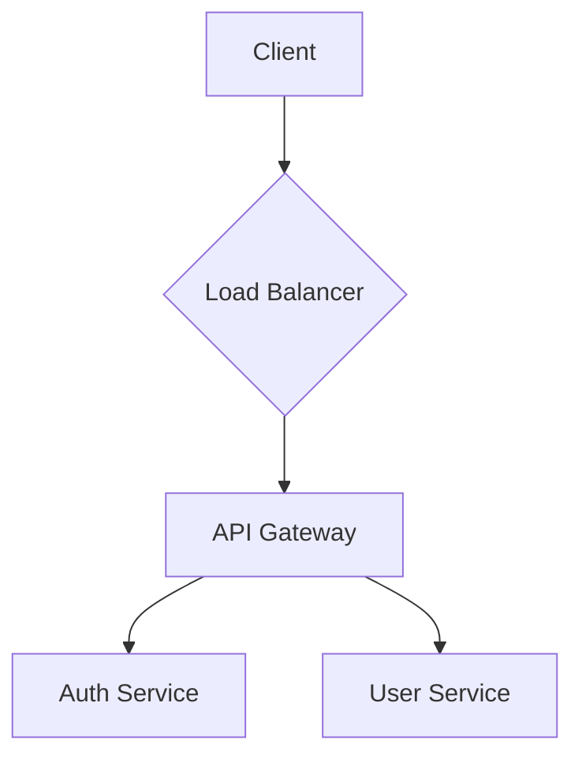

# SmartSpec Workflow: Docs Generator

**Workflow:** `/smartspec_docs_generator`  
**Version:** 6.1.1

## 1. Overview

The Docs Generator is a versatile workflow that automates the creation of project documentation. It can generate various types of documents by pulling information from your `spec.md`, project structure, and source code.

This workflow is **preview-first**. By default, it only writes reports. To write documentation into your project, you must use the `--apply` and `--write-docs` flags.

## 2. Key Features

- **Multiple Modes:** Supports different documentation types:
    -   `api-docs`: Generates API reference documentation.
    -   `user-guide`: Creates a user guide for your application.
    -   `architecture-diagram`: Generates diagram source files (e.g., Mermaid, PlantUML).
- **Source-Driven:** Uses your `spec.md` and code as the single source of truth.
- **Governed Writes:** Ensures that documentation is only written to approved directories when explicitly requested.
- **Template-Based:** Can use custom templates to standardize documentation.

## 3. How It Works

1.  **Selects Mode:** Operates based on the specified `--mode`.
2.  **Gathers Information:** Reads the `spec.md`, source code, and other project files.
3.  **Generates Content:** Creates the documentation content based on the selected mode and gathered information.
4.  **Renders Output:** Produces the final documentation files (e.g., Markdown, diagram source files).
5.  **Writes Output:** By default, writes a preview to the reports directory. With `--apply` and `--write-docs`, it writes the final documentation to the specified target directory.

## 4. Usage

### Generate API Docs (Preview)

```bash
/smartspec_docs_generator \
  --mode api-docs \
  --spec specs/my-api/spec.md \
  --schema-source path/to/openapi.yaml
```

### Generate and Apply a User Guide

```bash
/smartspec_docs_generator \
  --mode user-guide \
  --spec specs/my-app/spec.md \
  --target-dir docs/guide \
  --apply \
  --write-docs
```

## 5. Input and Flags

- **`--mode <type>` (Required):** The type of documentation to generate (`api-docs`, `user-guide`, `architecture-diagram`).
- **`--spec <path>` (Required):** Path to the `spec.md` file.
- **`--target-dir <path>` (Required for apply):** The destination directory for the generated documentation.
- **`--apply` and `--write-docs` (Required for apply):** Flags to enable writing to the target directory.
- **`--schema-source <path|url>` (Optional):** Path or URL to an API schema file (for `api-docs` mode).
- **`--template <path>` (Optional):** Path to a custom documentation template.

## 6. Output: Documentation Files

The output depends on the mode. It can be a set of Markdown files for a user guide, an API reference page, or source files for diagrams.

### Example Output for `architecture-diagram`

**File:** `docs/architecture/system.mmd`



## 7. Use Cases

- **Living Documentation:** Keep your documentation synchronized with your project's evolution.
- **Automate API Docs:** Automatically generate and update your API reference every time your OpenAPI schema changes.
- **Visualize Architecture:** Create architecture diagrams directly from your `spec.md` to ensure they are always up-to-date.
