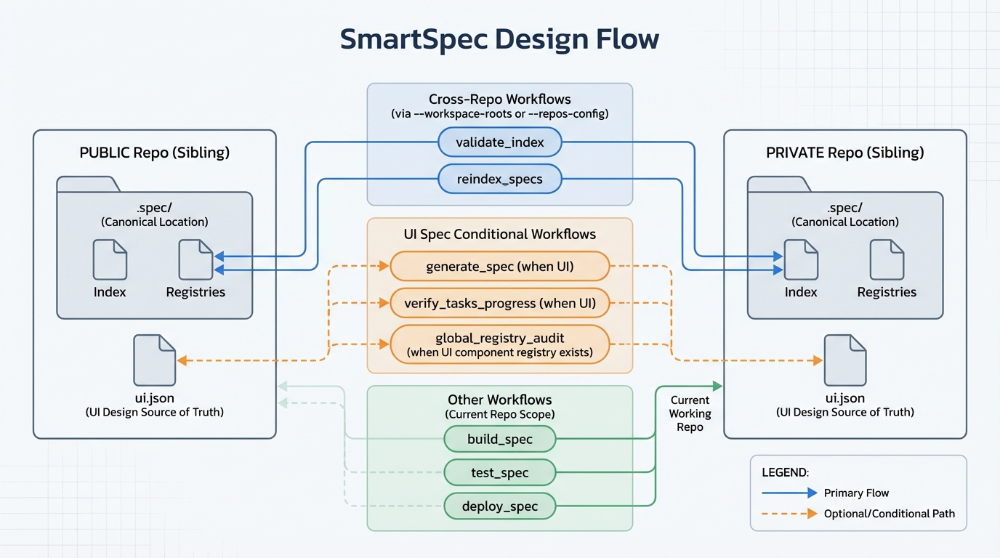

# SmartSpec Workflows Overview (v5.2)

This one-page guide gives you a full picture of **when to use each SmartSpec workflow**, what it does, and how the workflows connect end-to-end.


It reflects the **v5.2 centralization model**:

- **Canonical project-owned space:** `.spec/`
- **Canonical index:** `.spec/SPEC_INDEX.json`
- **Shared truth (optional):** `.spec/registry/`
- **Legacy mirror (optional):** `SPEC_INDEX.json` at repo root
- `.smartspec/` is tooling-only
- **UI specs (optional):** `ui.json` is the design source of truth when your project adopts Penpot JSON-first UI

Workflows that **only generate prompts** are excluded from this overview.

---


## The Big Picture: Recommended Order

1) **Portfolio & Lifecycle Governance** (program-level)  
2) **Index Health & Registry Alignment** (system-level truth)  
3) **Spec → Plan → Tasks** (design-to-execution breakdown)  
4) **Implement → Tests → Verify** (delivery loop)  
5) **Sync, Reverse, Refactor, Fix** (keep everything aligned over time)

---

## 1) Portfolio & Lifecycle Governance

These workflows help you shape the roadmap and manage evolution across many teams and many specs.

### `/smartspec_portfolio_planner`

**Purpose:** Create a strategic portfolio view across categories, dependencies, capabilities, and (optionally) public/private splits.

**Use when:**
- Quarterly planning
- You need to see what should be built first
- You want to detect missing foundational specs

**Key outputs:** `.spec/reports/portfolio-planner/`

**Example:**
```bash
/smartspec_portfolio_planner
/smartspec_portfolio_planner --view=dependency
```

### `/smartspec_spec_lifecycle_manager`

**Purpose:** Promote/demote specs through lifecycle states (planned → active → stable → deprecated → archived) safely.

**Use when:**
- Moving roadmap specs into execution
- Deprecating shared contracts
- Managing risk for core dependencies

**Key outputs:** `.spec/SPEC_INDEX.json`, `.spec/reports/spec-lifecycle/`

**Example:**
```bash
/smartspec_spec_lifecycle_manager --spec-id=spec-core-003-audit-logging --set-status=stable
/smartspec_spec_lifecycle_manager --spec-id=spec-foo --deprecate --mode=runtime --strict
```

---

## 2) Index Health & Registry Alignment

These workflows ensure your ecosystem does not contradict itself.

### `/smartspec_validate_index`

**Purpose:** Validate the integrity of `SPEC_INDEX.json` (paths, dependencies, duplicates, circular refs, metadata) with optional **multi-repo awareness**.

**Use when:**
- After large changes
- Before releases (use runtime mode)
- Your index health looks suspicious

**Key outputs:** `.spec/reports/validate-index/`

**Example:**
```bash
/smartspec_validate_index --report=detailed
/smartspec_validate_index --mode=runtime --strict
# Multi-repo verification
/smartspec_validate_index --workspace-roots="../PublicRepo,../PrivateRepo" --report=detailed
```

### `/smartspec_reindex_specs`

**Purpose:** Rebuild the canonical index by scanning real `specs/**/spec.md` folders (supports **multi-repo scan** in v5.2).

**Use when:**
- Many specs were added/moved
- You want to regenerate a clean index from files

**Key outputs:** `.spec/SPEC_INDEX.json`, `.spec/reports/reindex-specs/`

**Example:**
```bash
/smartspec_reindex_specs
# Multi-repo scan
/smartspec_reindex_specs --workspace-roots="../PublicRepo,../PrivateRepo"
```

### `/smartspec_global_registry_audit`

**Purpose:** Audit the shared naming/definition layer (APIs, models, glossary, critical sections, patterns, UI components).

**Use when:**
- Multiple teams create overlapping specs
- You suspect model/API/term drift

**Key outputs:** `.spec/reports/registry-audit/`

**Example:**
```bash
/smartspec_global_registry_audit
/smartspec_global_registry_audit --mode=runtime --strict
```

---

## 3) Spec → Plan → Tasks

These workflows take you from a defined spec to an execution-ready delivery structure.

### `/smartspec_generate_spec`

**Purpose:** Create a new `spec.md` or repair a legacy spec while aligning to `.spec/registry` and index rules.

**Key modes:**
- Standard generation
- Legacy repair (read-only on the original spec)

**Use when:**
- Creating a new spec
- Migrating old specs into v5.2 centralization

**Example:**
```bash
/smartspec_generate_spec specs/core/spec-core-004-rate-limiting/spec.md
# Repair legacy without changing core content
/smartspec_generate_spec specs/core/spec-core-004-rate-limiting/spec.md --repair-legacy --repair-additive-meta
```

### `/smartspec_generate_plan`

**Purpose:** Produce a delivery plan **derived from one or more specs** to distribute work across teams and milestones.

**Use when:**
- You already have a spec (or a cluster of related specs)
- You need a clear multi-team execution roadmap

**Example:**
```bash
/smartspec_generate_plan specs/core/spec-core-004-rate-limiting/spec.md
# Or plan a folder/cluster
/smartspec_generate_plan specs/core/spec-core-004-rate-limiting/
```

### `/smartspec_generate_tasks`

**Purpose:** Convert spec requirements into an actionable `tasks.md` with proper sequencing and cross-SPEC awareness.

**Use when:**
- You want implementation-ready breakdowns

**Example:**
```bash
/smartspec_generate_tasks specs/core/spec-core-004-rate-limiting/spec.md
```

---

## 4) Implement → Tests → Verify

The delivery loop that connects tasks to real code outcomes.

### `/smartspec_implement_tasks`

**Purpose:** Generate an implementation approach from `tasks.md` while checking the canonical index/registry to avoid guessing shared names.

**Use when:**
- Starting implementation
- Coordinating large task sets

**Example:**
```bash
/smartspec_implement_tasks specs/core/spec-core-004-rate-limiting/tasks.md
```

### `/smartspec_generate_tests`

**Purpose:** Generate or propose tests aligned to spec requirements and tasks.

**Use when:**
- You want consistent test coverage gates

**Example:**
```bash
/smartspec_generate_tests specs/core/spec-core-004-rate-limiting/spec.md
```

### `/smartspec_verify_tasks_progress`

**Purpose:** Check real progress against tasks/specs, with optional registry and UI JSON checks.

**Use when:**
- Weekly progress review
- Before merging a large PR

**Example:**
```bash
/smartspec_verify_tasks_progress specs/core/spec-core-004-rate-limiting/spec.md
```

---

## 5) Sync, Reverse, Refactor, Fix

Workflows that keep the system coherent over time.

### `/smartspec_sync_spec_tasks`

**Purpose:** Sync safe, non-destructive signals from specs/tasks back into the canonical index and (optionally) additive registry suggestions.

**Use when:**
- You updated tasks/specs significantly
- You want the index to reflect reality

**Example:**
```bash
/smartspec_sync_spec_tasks --spec=specs/core/spec-core-004-rate-limiting/spec.md
/smartspec_sync_spec_tasks --spec=specs/core/spec-core-004-rate-limiting/spec.md --mode=additive
```

### `/smartspec_reverse_to_spec`

**Purpose:** Derive or update spec understanding from existing codebases when specs are missing or outdated.

**Use when:**
- You inherited code without complete specs

**Example:**
```bash
/smartspec_reverse_to_spec src/
```

### `/smartspec_refactor_code`

**Purpose:** Suggest or coordinate refactors that keep code aligned with canonical specs and registries.

**Use when:**
- The implementation drifted from spec intent

**Example:**
```bash
/smartspec_refactor_code specs/core/spec-core-004-rate-limiting/spec.md
```

### `/smartspec_fix_errors`

**Purpose:** Provide focused, mechanical fixes and guidance for issues surfaced by other workflows (validation, verification, generation).

**Typical inputs:**
- A specific spec (recommended)
- Or a report produced by another workflow

**Use when:**
- You want to fix reported issues without manually hunting the root cause

**Example (spec-targeted):**
```bash
/smartspec_fix_errors specs/core/spec-core-004-rate-limiting/spec.md
```

**Example (report-targeted):**
```bash
/smartspec_fix_errors --report=.spec/reports/validate-index/latest.md
```

If your local implementation of this workflow supports both styles, prefer the **spec-targeted** form to keep scope precise.

---

## UI Design Workflow (Optional)

If your project uses Penpot JSON-first UI:

- Each UI spec folder may include:
  - `spec.md`
  - `ui.json`

Guiding rule:

- **`ui.json` = design structure + component mapping**
- **`spec.md` = responsibilities + constraints + logic boundaries**

UI-related checks are **conditional**. Projects without UI JSON will not fail because of this.

---

## Vibe Coding Readiness (Small → Large Projects)

SmartSpec v5.2 is designed to support fast, AI-assisted, “vibe coding” style iteration **without losing system integrity**.

### Small Projects

Recommended lightweight loop:

- `/smartspec_generate_spec` → `/smartspec_generate_tasks` → `/smartspec_implement_tasks` → `/smartspec_generate_tests` → `/smartspec_verify_tasks_progress`

You can often skip portfolio/governance unless you plan to scale.

### Medium Projects

Add health gates at key moments:

- Use `/smartspec_validate_index` after adding several specs
- Use `/smartspec_sync_spec_tasks` to keep the index aligned
- Run `/smartspec_global_registry_audit` occasionally to prevent naming drift

### Large Projects

Use the full governance stack:

- `/smartspec_portfolio_planner` to align multi-team priorities
- `/smartspec_spec_lifecycle_manager` to manage risk in shared contracts
- `/smartspec_validate_index` (multi-repo if needed) as a continuous quality gate
- `/smartspec_reindex_specs` after structural moves
- `/smartspec_global_registry_audit` to keep shared names stable

This combination prevents the common failure mode of vibe coding at scale: **contradictory specs and diverging shared contracts**.

---

## Quick Decision Map

- **I need a roadmap across many specs:**
  - `/smartspec_portfolio_planner`

- **I want to move specs across lifecycle states safely:**
  - `/smartspec_spec_lifecycle_manager`

- **My index looks wrong or outdated:**
  - `/smartspec_validate_index` → `/smartspec_reindex_specs`

- **Teams are naming things differently:**
  - `/smartspec_global_registry_audit`

- **I’m starting new work from scratch:**
  - `/smartspec_generate_spec` → `/smartspec_generate_plan` → `/smartspec_generate_tasks`

- **I’m implementing:**
  - `/smartspec_implement_tasks` → `/smartspec_generate_tests` → `/smartspec_verify_tasks_progress`

- **Docs and reality drifted:**
  - `/smartspec_sync_spec_tasks` and/or `/smartspec_reverse_to_spec`

- **I have a report full of issues and want guided fixes:**
  - `/smartspec_fix_errors` (spec-targeted or report-targeted)

---

## Minimal End-to-End Example

```bash
# 1) Generate or repair the spec
/smartspec_generate_spec specs/core/spec-core-004-rate-limiting/spec.md

# 2) Turn the spec into a delivery plan (team/milestone breakdown)
/smartspec_generate_plan specs/core/spec-core-004-rate-limiting/spec.md

# 3) Break down implementation tasks
/smartspec_generate_tasks specs/core/spec-core-004-rate-limiting/spec.md

# 4) Implement guided by tasks/spec
/smartspec_implement_tasks specs/core/spec-core-004-rate-limiting/tasks.md

# 5) Propose tests
/smartspec_generate_tests specs/core/spec-core-004-rate-limiting/spec.md

# 6) Verify progress
/smartspec_verify_tasks_progress specs/core/spec-core-004-rate-limiting/spec.md

# 7) Sync safe metadata back to the canonical layer
/smartspec_sync_spec_tasks --spec=specs/core/spec-core-004-rate-limiting/spec.md
```

---

## Notes on Multi-Repo Projects

- **Validation** supports multi-repo checks using `--workspace-roots` or `--repos-config`.
- **Reindexing** supports multi-repo scan to discover real spec files.
- Other workflows typically operate within the current repo unless your team extends them.

If you do not provide multi-repo flags, workflows default to the **current repository only**.

---

## What’s Excluded

This overview excludes workflows that only generate prompt templates (e.g., cursor/implement prompt generators).

---

## Summary

SmartSpec v5.2 gives you a coherent, full-cycle system:

- Govern the portfolio
- Keep the index and registries healthy
- Generate specs, then derive plans and tasks
- Implement rapidly with fewer conflicts
- Validate, verify, and sync changes continuously

Use this page as your single-entry map for choosing the right workflow at the right time.

