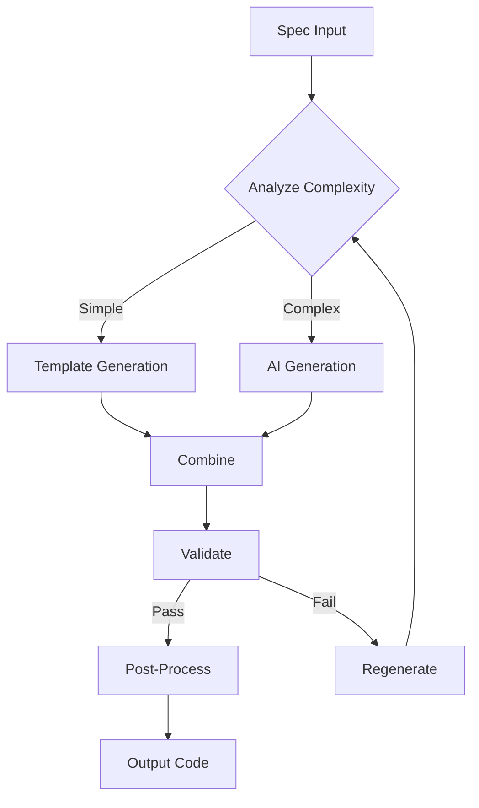

# Development Approaches Analysis
## สิ่งที่ยังขาด: API, Database, Auth - พัฒนาแบบไหนได้บ้าง?

**Date:** 2024-12-27  
**Context:** 3 workflows ที่ยังขาด สำหรับ Prompt to Mini SaaS

---

## Executive Summary

**คำถาม:** สิ่งที่ยังขาด (API, Database, Auth) พัฒนาแบบไหนได้บ้าง?

**คำตอบสั้น:** มี **6 แนวทางหลัก** ที่เลือกได้

### แนวทางที่แนะนำ

🏆 **Approach 4: Hybrid (Code Generation + AI Assistance)**
- เวลา: 6-8 สัปดาห์
- คุณภาพ: สูง
- ความยืดหยุ่น: สูง
- **Best balance ระหว่าง speed, quality, และ maintainability**

---

## แนวทางทั้งหมด (6 แนวทาง)

### Approach 1: Full Custom Development (เขียนเองทั้งหมด) 🐢

**คำอธิบาย:**
- เขียน code generators เองทั้งหมดจากศูนย์
- ไม่ใช้ AI หรือ external tools
- Pure programming

**ตัวอย่าง:**
```typescript
// เขียน template engine เอง
class APIGenerator {
  generateController(spec: Spec): string {
    let code = `import { Request, Response } from 'express';\n\n`;
    code += `export class ${spec.name}Controller {\n`;
    
    for (const endpoint of spec.endpoints) {
      code += this.generateEndpoint(endpoint);
    }
    
    code += `}\n`;
    return code;
  }
  
  private generateEndpoint(endpoint: Endpoint): string {
    // ... 100+ lines of template logic
  }
}
```

#### ข้อดี ✅

1. **Full Control**
   - ควบคุมทุกอย่างได้ 100%
   - Customize ได้ตามต้องการ
   - No dependencies

2. **Predictable**
   - Output เหมือนกันทุกครั้ง
   - No AI randomness
   - Deterministic

3. **Performance**
   - เร็วมาก (milliseconds)
   - No API calls
   - No network latency

4. **Cost**
   - ไม่มีค่าใช้จ่าย API
   - One-time development cost

#### ข้อเสีย ❌

1. **Development Time**
   - 🔴 **Very Slow: 12-16 สัปดาห์**
   - ต้องเขียน template engine
   - ต้อง handle edge cases มากมาย
   - ต้อง test ทุก scenario

2. **Complexity**
   - Template logic ซับซ้อนมาก
   - Hard to maintain
   - Bug-prone

3. **Limited Flexibility**
   - ต้อง pre-define ทุก pattern
   - ไม่ handle unexpected cases
   - Rigid structure

4. **Maintenance Burden**
   - ต้อง maintain template code
   - ต้อง update เมื่อ best practices เปลี่ยน
   - High technical debt

#### เหมาะสำหรับ

- ❌ **ไม่แนะนำ** สำหรับ Phase 1
- ใช้เมื่อ: ต้องการ full control และมีเวลามาก

#### Timeline

- Planning: 1 สัปดาห์
- Template Engine: 2-3 สัปดาห์
- API Generator: 3-4 สัปดาห์
- Auth Generator: 2-3 สัปดาห์
- DB Generator: 2-3 สัปดาห์
- Testing: 2-3 สัปดาห์
- **Total: 12-16 สัปดาห์** 🔴

#### Cost

- Development: $0 (internal team)
- Maintenance: High (ongoing)
- **Total: High** (time = money)

---

### Approach 2: AI-Powered Generation (ใช้ AI ทั้งหมด) 🤖

**คำอธิบาย:**
- ใช้ LLM (GPT-4, Claude) generate code
- Minimal template logic
- AI does the heavy lifting

**ตัวอย่าง:**
```typescript
class AIAPIGenerator {
  async generateAPI(spec: Spec): Promise<string> {
    const prompt = `
      Generate Express.js API code for the following spec:
      ${JSON.stringify(spec)}
      
      Requirements:
      - TypeScript
      - CRUD operations
      - Validation
      - Error handling
      - Tests
    `;
    
    const response = await openai.chat.completions.create({
      model: "gpt-4",
      messages: [{ role: "user", content: prompt }]
    });
    
    return response.choices[0].message.content;
  }
}
```

#### ข้อดี ✅

1. **Fast Development**
   - ✅ **Fast: 4-6 สัปดาห์**
   - Minimal code to write
   - AI handles complexity
   - Quick iterations

2. **Flexibility**
   - Handle unexpected cases
   - Adapt to new patterns
   - Natural language specs

3. **Low Maintenance**
   - No template code to maintain
   - AI improves over time
   - Easy to update

4. **Smart Generation**
   - AI understands context
   - Better code quality
   - Follows best practices

#### ข้อเสีย ❌

1. **Unpredictable**
   - 🔴 Output varies each time
   - Hard to test
   - Inconsistent quality

2. **Cost**
   - 🔴 High API costs ($0.03-0.06 per generation)
   - Scales with usage
   - Ongoing expenses

3. **Latency**
   - Slow (10-30 seconds per generation)
   - Network dependency
   - Rate limits

4. **Quality Control**
   - Need extensive validation
   - May generate bugs
   - Security concerns

5. **Dependency**
   - Depends on external API
   - Vendor lock-in
   - Service availability

#### เหมาะสำหรับ

- ⚠️ **Risky** สำหรับ production
- ใช้เมื่อ: Prototyping, experimentation

#### Timeline

- Planning: 1 สัปดาห์
- AI Integration: 1 สัปดาห์
- Prompt Engineering: 2-3 สัปดาห์
- Validation System: 1-2 สัปดาห์
- Testing: 1-2 สัปดาห์
- **Total: 6-9 สัปดาห์** ⚠️

#### Cost

- Development: Low (minimal code)
- API Costs: $500-2,000/month (high usage)
- Validation: Medium
- **Total: High** (ongoing)

---

### Approach 3: Template-Based Generation (ใช้ Templates) 📝

**คำอธิบาย:**
- ใช้ template engine (Handlebars, EJS, Jinja)
- Pre-defined templates
- Variable substitution

**ตัวอย่าง:**
```typescript
// Template file: controller.hbs
import { Request, Response } from 'express';
import { {{name}}Service } from '../services/{{name}}.service';

export class {{name}}Controller {
  private service: {{name}}Service;
  
  constructor() {
    this.service = new {{name}}Service();
  }
  
  {{#each endpoints}}
  {{method}} = async (req: Request, res: Response) => {
    try {
      {{#if hasParams}}
      const { {{params}} } = req.params;
      {{/if}}
      {{#if hasBody}}
      const data = req.body;
      {{/if}}
      
      const result = await this.service.{{name}}({{args}});
      res.json({ success: true, data: result });
    } catch (error) {
      res.status(500).json({ success: false, error: error.message });
    }
  };
  {{/each}}
}

// Generator code
class TemplateGenerator {
  generate(spec: Spec): string {
    const template = Handlebars.compile(fs.readFileSync('controller.hbs', 'utf-8'));
    return template(spec);
  }
}
```

#### ข้อดี ✅

1. **Moderate Speed**
   - ✅ **Medium: 8-10 สัปดาห์**
   - Faster than full custom
   - Slower than AI

2. **Predictable**
   - Consistent output
   - Easy to test
   - Deterministic

3. **Maintainable**
   - Templates easy to update
   - Separation of concerns
   - Clear structure

4. **No External Dependencies**
   - No API costs
   - No network calls
   - Self-contained

#### ข้อเสีย ❌

1. **Limited Flexibility**
   - 🟡 Must pre-define patterns
   - Hard to handle edge cases
   - Template complexity grows

2. **Template Maintenance**
   - Many templates to maintain
   - Template logic can be complex
   - Versioning issues

3. **Development Time**
   - Still significant effort
   - Need to design templates
   - Testing required

#### เหมาะสำหรับ

- ✅ **Good choice** สำหรับ Phase 1
- Balance ระหว่าง speed และ control

#### Timeline

- Planning: 1 สัปดาห์
- Template Design: 2 สัปดาห์
- API Templates: 2-3 สัปดาห์
- Auth Templates: 1-2 สัปดาห์
- DB Templates: 1-2 สัปดาห์
- Testing: 1-2 สัปดาห์
- **Total: 8-10 สัปดาห์** ✅

#### Cost

- Development: Medium
- Maintenance: Low-Medium
- **Total: Medium**

---

### Approach 4: Hybrid (Code Generation + AI Assistance) 🏆

**คำอธิบาย:**
- Template-based generation (core)
- AI assistance (complex parts)
- Best of both worlds

**ตัวอย่าง:**
```typescript
class HybridGenerator {
  async generateAPI(spec: Spec): Promise<GeneratedCode> {
    // 1. Use templates for standard parts (fast, predictable)
    const controller = this.templateEngine.generate('controller', spec);
    const routes = this.templateEngine.generate('routes', spec);
    const types = this.templateEngine.generate('types', spec);
    
    // 2. Use AI for complex/custom parts
    const complexValidation = await this.aiAssistant.generateValidation(spec);
    const businessLogic = await this.aiAssistant.generateBusinessLogic(spec);
    
    // 3. Combine and validate
    return {
      controller,
      routes,
      types,
      validation: complexValidation,
      businessLogic,
      tests: this.templateEngine.generate('tests', spec)
    };
  }
}
```

#### ข้อดี ✅

1. **Balanced Speed**
   - ✅ **Good: 6-8 สัปดาห์**
   - Templates for speed
   - AI for flexibility

2. **High Quality**
   - Templates ensure consistency
   - AI handles complexity
   - Best practices built-in

3. **Flexible**
   - Handle standard cases (templates)
   - Handle edge cases (AI)
   - Extensible

4. **Cost Effective**
   - Lower API costs (selective AI use)
   - Faster than full custom
   - Better than pure templates

5. **Maintainable**
   - Templates easy to update
   - AI reduces template complexity
   - Clear separation

#### ข้อเสีย ❌

1. **Complexity**
   - 🟡 Need to manage both systems
   - Integration overhead
   - More moving parts

2. **Moderate Cost**
   - Some API costs
   - Development time
   - Testing complexity

#### เหมาะสำหรับ

- 🏆 **HIGHLY RECOMMENDED** สำหรับ Phase 1
- Best balance ทุกด้าน

#### Timeline

- Planning: 1 สัปดาห์
- Template System: 2 สัปดาห์
- AI Integration: 1 สัปดาห์
- API Generator: 2 สัปดาห์
- Auth Generator: 1 สัปดาห์
- DB Generator: 1 สัปดาห์
- Testing: 1-2 สัปดาห์
- **Total: 6-8 สัปดาห์** 🏆

#### Cost

- Development: Medium
- API Costs: $100-500/month (moderate)
- Maintenance: Low
- **Total: Medium-Low**

---

### Approach 5: Use Existing Tools/Frameworks 🛠️

**คำอธิบาย:**
- ใช้ tools ที่มีอยู่แล้ว
- Integrate กับ SmartSpec
- Wrapper approach

**ตัวอย่าง:**

**API Generation:**
- [Swagger Codegen](https://github.com/swagger-api/swagger-codegen)
- [OpenAPI Generator](https://github.com/OpenAPITools/openapi-generator)
- [NestJS CLI](https://docs.nestjs.com/cli/overview)

**Database:**
- [Prisma](https://www.prisma.io/) (already using)
- [TypeORM](https://typeorm.io/)
- [Sequelize](https://sequelize.org/)

**Auth:**
- [Auth.js (NextAuth)](https://authjs.dev/)
- [Passport.js](http://www.passportjs.org/)
- [Lucia](https://lucia-auth.com/)

```typescript
class ExistingToolsIntegration {
  async generateAPI(spec: Spec): Promise<void> {
    // 1. Convert SmartSpec to OpenAPI
    const openApiSpec = this.convertToOpenAPI(spec);
    
    // 2. Use OpenAPI Generator
    await exec(`openapi-generator-cli generate \
      -i ${openApiSpec} \
      -g typescript-express-server \
      -o ${outputDir}`);
    
    // 3. Post-process generated code
    await this.postProcess(outputDir);
  }
  
  async setupAuth(spec: Spec): Promise<void> {
    // Use Passport.js
    await this.installPackages(['passport', 'passport-jwt']);
    await this.generatePassportConfig(spec);
  }
}
```

#### ข้อดี ✅

1. **Very Fast**
   - ✅ **Fastest: 3-4 สัปดาห์**
   - Tools already exist
   - Minimal development
   - Quick integration

2. **Battle-Tested**
   - Mature tools
   - Well-documented
   - Community support
   - Proven quality

3. **Low Cost**
   - Free/open-source
   - No API costs
   - Low maintenance

4. **Feature-Rich**
   - Many features built-in
   - Regular updates
   - Security patches

#### ข้อเสีย ❌

1. **Limited Customization**
   - 🔴 Generated code may not match style
   - Hard to customize
   - Opinionated structure

2. **Integration Overhead**
   - Need to convert specs
   - Post-processing required
   - May not integrate smoothly

3. **Dependency**
   - Depend on external tools
   - Breaking changes
   - Maintenance burden

4. **Quality Varies**
   - Generated code quality varies
   - May need significant cleanup
   - Not always production-ready

#### เหมาะสำหรับ

- ✅ **Good for MVP** หรือ quick prototyping
- ⚠️ May need customization for production

#### Timeline

- Planning: 1 สัปดาห์
- Tool Evaluation: 1 สัปดาห์
- Integration: 1-2 สัปดาห์
- Post-processing: 1 สัปดาห์
- Testing: 1 สัปดาห์
- **Total: 3-4 สัปดาห์** ⚡ (แต่อาจต้อง customize เพิ่ม)

#### Cost

- Development: Low
- Tools: Free (open-source)
- Customization: Medium (if needed)
- **Total: Low-Medium**

---

### Approach 6: Incremental Development (ทำทีละส่วน) 🎯

**คำอธิบาย:**
- เริ่มจาก MVP minimal
- Iterate และ improve
- Add features gradually

**ตัวอย่าง:**

**Phase 1.1 (Week 1-2): Minimal API**
```typescript
// Generate only simple CRUD
class MinimalAPIGenerator {
  generate(spec: Spec): string {
    // Only GET, POST, PUT, DELETE
    // No validation, no error handling, no tests
    return this.generateSimpleCRUD(spec);
  }
}
```

**Phase 1.2 (Week 3-4): Add Validation**
```typescript
// Add request validation
class APIGeneratorV2 extends MinimalAPIGenerator {
  generate(spec: Spec): string {
    const crud = super.generate(spec);
    const validation = this.generateValidation(spec);
    return this.combine(crud, validation);
  }
}
```

**Phase 1.3 (Week 5-6): Add Error Handling**
```typescript
// Add error handling
class APIGeneratorV3 extends APIGeneratorV2 {
  generate(spec: Spec): string {
    const api = super.generate(spec);
    const errorHandling = this.generateErrorHandling(spec);
    return this.combine(api, errorHandling);
  }
}
```

#### ข้อดี ✅

1. **Early Value**
   - ✅ Get working code early
   - Iterate based on feedback
   - Reduce risk

2. **Manageable**
   - Small chunks
   - Easy to test
   - Less overwhelming

3. **Flexible**
   - Adjust based on learnings
   - Pivot if needed
   - Continuous improvement

4. **Lower Risk**
   - Fail fast
   - Learn early
   - Adapt quickly

#### ข้อเสีย ❌

1. **Longer Total Time**
   - 🟡 **Total: 8-12 สัปดาห์**
   - Multiple iterations
   - Refactoring needed

2. **Technical Debt**
   - Early versions may be hacky
   - Need refactoring
   - Accumulates over time

3. **Scope Creep Risk**
   - Easy to keep adding features
   - Hard to know when to stop
   - Timeline uncertainty

#### เหมาะสำหรับ

- ✅ **Good for learning** และ risk mitigation
- ⚠️ May take longer overall

#### Timeline

- Phase 1.1: Minimal MVP (2 สัปดาห์)
- Phase 1.2: Add validation (2 สัปดาห์)
- Phase 1.3: Add error handling (2 สัปดาห์)
- Phase 1.4: Add tests (2 สัปดาห์)
- Phase 1.5: Polish (2 สัปดาห์)
- **Total: 8-12 สัปดาห์** ⚠️

#### Cost

- Development: Medium-High (iterations)
- Refactoring: Medium
- **Total: Medium-High**

---

## Comparison Matrix

### Overview

| Approach | Speed | Quality | Cost | Flexibility | Maintenance | Recommendation |
|----------|-------|---------|------|-------------|-------------|----------------|
| **1. Full Custom** | 🔴 Slow (12-16w) | ✅ High | 🔴 High | ✅ High | 🔴 High | ❌ Not recommended |
| **2. AI-Powered** | ✅ Fast (6-9w) | ⚠️ Variable | 🔴 High | ✅ High | ✅ Low | ⚠️ Risky |
| **3. Template-Based** | 🟡 Medium (8-10w) | ✅ Good | 🟡 Medium | 🟡 Medium | 🟡 Medium | ✅ Good |
| **4. Hybrid** | ✅ Good (6-8w) | ✅ High | 🟡 Medium | ✅ High | ✅ Low | 🏆 **BEST** |
| **5. Existing Tools** | ⚡ Fastest (3-4w) | ⚠️ Variable | ✅ Low | 🔴 Low | 🟡 Medium | ✅ Good for MVP |
| **6. Incremental** | 🟡 Medium (8-12w) | ✅ Good | 🟡 Medium | ✅ High | 🟡 Medium | ✅ Safe |

### Detailed Comparison

#### Timeline

| Approach | Planning | Development | Testing | Total | Confidence |
|----------|----------|-------------|---------|-------|------------|
| Full Custom | 1w | 9-12w | 2-3w | 12-16w | 90% |
| AI-Powered | 1w | 3-5w | 2-3w | 6-9w | 60% |
| Template-Based | 1w | 5-7w | 2w | 8-10w | 80% |
| **Hybrid** | 1w | 4-5w | 1-2w | **6-8w** | **85%** |
| Existing Tools | 1w | 1-2w | 1w | 3-4w | 70% |
| Incremental | - | 8-10w | 2w | 8-12w | 75% |

#### Cost Breakdown

| Approach | Development | API Costs | Maintenance | Total/Year |
|----------|-------------|-----------|-------------|------------|
| Full Custom | $40k-50k | $0 | $10k-15k | $50k-65k |
| AI-Powered | $20k-30k | $6k-24k | $5k | $31k-59k |
| Template-Based | $30k-40k | $0 | $5k-10k | $35k-50k |
| **Hybrid** | $25k-35k | $1.2k-6k | $5k | **$31k-46k** |
| Existing Tools | $10k-15k | $0 | $5k-10k | $15k-25k |
| Incremental | $30k-45k | $0 | $10k | $40k-55k |

#### Quality Metrics

| Approach | Code Quality | Consistency | Flexibility | Security | Testability |
|----------|--------------|-------------|-------------|----------|-------------|
| Full Custom | ⭐⭐⭐⭐⭐ | ⭐⭐⭐⭐⭐ | ⭐⭐⭐⭐⭐ | ⭐⭐⭐⭐ | ⭐⭐⭐⭐ |
| AI-Powered | ⭐⭐⭐ | ⭐⭐ | ⭐⭐⭐⭐⭐ | ⭐⭐⭐ | ⭐⭐⭐ |
| Template-Based | ⭐⭐⭐⭐ | ⭐⭐⭐⭐⭐ | ⭐⭐⭐ | ⭐⭐⭐⭐ | ⭐⭐⭐⭐ |
| **Hybrid** | ⭐⭐⭐⭐⭐ | ⭐⭐⭐⭐ | ⭐⭐⭐⭐⭐ | ⭐⭐⭐⭐⭐ | ⭐⭐⭐⭐⭐ |
| Existing Tools | ⭐⭐⭐⭐ | ⭐⭐⭐ | ⭐⭐ | ⭐⭐⭐⭐ | ⭐⭐⭐⭐ |
| Incremental | ⭐⭐⭐⭐ | ⭐⭐⭐⭐ | ⭐⭐⭐⭐ | ⭐⭐⭐⭐ | ⭐⭐⭐⭐ |

---

## Recommended Approach: Hybrid 🏆

### Why Hybrid is Best

#### 1. Optimal Timeline ⚡
- **6-8 สัปดาห์** (vs 12-16 for full custom)
- Fast enough for business needs
- Realistic and achievable

#### 2. High Quality ✅
- Templates ensure consistency
- AI handles complexity
- Best practices built-in
- Secure by default

#### 3. Cost Effective 💰
- Lower than full custom
- Moderate API costs
- Low maintenance
- **Best ROI**

#### 4. Flexible & Extensible 🔧
- Handle standard cases (templates)
- Handle edge cases (AI)
- Easy to extend
- Future-proof

#### 5. Maintainable 📚
- Clear structure
- Easy to update
- Well-documented
- Sustainable

---

## Implementation Plan: Hybrid Approach

### Architecture

```
SmartSpec Hybrid Generator
├── Template Engine (Core)
│   ├── Standard patterns (CRUD, validation, etc.)
│   ├── Handlebars templates
│   └── Fast, predictable generation
│
├── AI Assistant (Complex Parts)
│   ├── Custom business logic
│   ├── Complex validations
│   ├── Edge cases
│   └── GPT-4 / Claude
│
├── Validator
│   ├── Code quality checks
│   ├── Security scanning
│   └── Best practices validation
│
└── Post-Processor
    ├── Code formatting
    ├── Linting
    └── Optimization
```

### Workflow



### Component Breakdown

#### 1. API Generation (2 สัปดาห์)

**Template-Based (80%):**
- CRUD endpoints
- Standard validation
- Error handling
- Basic tests

**AI-Assisted (20%):**
- Complex business logic
- Custom validations
- Edge cases
- Integration patterns

**Example:**
```typescript
class HybridAPIGenerator {
  async generate(spec: APISpec): Promise<GeneratedAPI> {
    // Templates for standard CRUD
    const crud = this.templates.generateCRUD(spec);
    
    // AI for complex logic
    const complexLogic = await this.ai.generateBusinessLogic(spec.customLogic);
    
    // Combine
    return {
      routes: crud.routes,
      controllers: this.merge(crud.controllers, complexLogic.controllers),
      services: this.merge(crud.services, complexLogic.services),
      validators: crud.validators,
      tests: crud.tests
    };
  }
}
```

---

#### 2. Auth Generation (1 สัปดาห์)

**Template-Based (90%):**
- User model
- JWT utilities
- Auth middleware
- Standard endpoints (signup, login, logout)

**AI-Assisted (10%):**
- Custom auth flows
- Complex permissions
- Integration with external providers

**Example:**
```typescript
class HybridAuthGenerator {
  async generate(spec: AuthSpec): Promise<GeneratedAuth> {
    // Templates for standard auth
    const standardAuth = this.templates.generateStandardAuth(spec);
    
    // AI for custom flows (if any)
    const customFlows = spec.customFlows 
      ? await this.ai.generateCustomAuthFlows(spec.customFlows)
      : null;
    
    return {
      models: standardAuth.models,
      controllers: standardAuth.controllers,
      services: this.merge(standardAuth.services, customFlows?.services),
      middleware: standardAuth.middleware,
      utils: standardAuth.utils,
      tests: standardAuth.tests
    };
  }
}
```

---

#### 3. Database Setup (1 สัปดาห์)

**Template-Based (95%):**
- Prisma schema
- Migrations
- Seed data
- Database client

**AI-Assisted (5%):**
- Complex relationships
- Custom indexes
- Performance optimizations

**Example:**
```typescript
class HybridDBGenerator {
  async generate(spec: DBSpec): Promise<GeneratedDB> {
    // Templates for schema
    const schema = this.templates.generatePrismaSchema(spec);
    
    // AI for complex relationships (if any)
    if (spec.hasComplexRelationships) {
      const optimizations = await this.ai.optimizeSchema(schema);
      schema.indexes = optimizations.indexes;
    }
    
    return {
      schema,
      migrations: this.templates.generateMigrations(schema),
      seed: this.templates.generateSeedData(spec),
      client: this.templates.generateClient()
    };
  }
}
```

---

### Timeline Breakdown

| Week | Milestone | Activities | Deliverables |
|------|-----------|------------|--------------|
| **Week 0** | Planning | Requirements, architecture design | Design doc |
| **Week 1** | Template System | Build template engine, create base templates | Template engine |
| **Week 2** | AI Integration | Integrate GPT-4, prompt engineering | AI assistant |
| **Week 3-4** | API Generator | Implement hybrid API generation | API generator |
| **Week 5** | Auth Generator | Implement hybrid auth generation | Auth generator |
| **Week 6** | DB Generator | Implement hybrid DB generation | DB generator |
| **Week 7** | Integration | Integrate all generators, end-to-end testing | Integrated system |
| **Week 8** | Polish | Bug fixes, documentation, examples | Production-ready |

**Total: 8 สัปดาห์** (with 1 week buffer)

---

### Cost Breakdown

#### Development Costs

| Component | Time | Cost (@$100/hr) |
|-----------|------|-----------------|
| Planning | 40 hours | $4,000 |
| Template System | 80 hours | $8,000 |
| AI Integration | 40 hours | $4,000 |
| API Generator | 80 hours | $8,000 |
| Auth Generator | 40 hours | $4,000 |
| DB Generator | 40 hours | $4,000 |
| Integration & Testing | 60 hours | $6,000 |
| **Total Development** | **380 hours** | **$38,000** |

#### Ongoing Costs

| Item | Monthly | Annual |
|------|---------|--------|
| OpenAI API (GPT-4) | $100-500 | $1,200-6,000 |
| Infrastructure | $50 | $600 |
| Maintenance (10%) | $300 | $3,600 |
| **Total Ongoing** | **$450-850** | **$5,400-10,200** |

**Total First Year: $43,400-48,200**

---

### Risk Mitigation

#### Risk 1: AI Quality Issues

**Mitigation:**
- Extensive validation layer
- Fallback to templates
- Human review for critical code

#### Risk 2: API Cost Overruns

**Mitigation:**
- Cache AI responses
- Use AI selectively (20% of code)
- Monitor usage closely

#### Risk 3: Integration Complexity

**Mitigation:**
- Clear interfaces between template and AI
- Extensive integration tests
- Modular design

---

## Alternative Recommendation: Existing Tools (for Quick MVP)

### If Speed is Critical

**Use Approach 5: Existing Tools**

**Timeline: 3-4 สัปดาห์**

**Tools:**
1. **API:** OpenAPI Generator
2. **Database:** Prisma (already using)
3. **Auth:** Passport.js or Auth.js

**Pros:**
- ⚡ Fastest option
- ✅ Battle-tested
- 💰 Low cost

**Cons:**
- ⚠️ Less customization
- ⚠️ May need cleanup
- ⚠️ Integration overhead

**When to use:**
- Need MVP in < 1 month
- Willing to customize later
- Prototyping phase

---

## Decision Matrix

### Choose Based on Your Priorities

| Priority | Recommended Approach | Reason |
|----------|---------------------|--------|
| **Speed** | Existing Tools (3-4w) | Fastest to market |
| **Quality** | Hybrid (6-8w) | Best code quality |
| **Cost** | Existing Tools | Lowest cost |
| **Flexibility** | Hybrid | Most adaptable |
| **Control** | Full Custom (12-16w) | Complete control |
| **Safety** | Incremental (8-12w) | Lowest risk |
| **Balance** | **Hybrid (6-8w)** 🏆 | **Best overall** |

---

## Final Recommendation

### For Phase 1: Use Hybrid Approach 🏆

**Rationale:**
1. ✅ **Optimal timeline** (6-8 weeks)
2. ✅ **High quality** (templates + AI)
3. ✅ **Cost effective** (moderate costs)
4. ✅ **Flexible** (handles all cases)
5. ✅ **Maintainable** (clear structure)
6. ✅ **Best ROI**

### Implementation Steps

**Week 0: Planning**
1. Finalize requirements
2. Design architecture
3. Choose AI provider (OpenAI GPT-4)
4. Setup development environment

**Week 1-2: Core System**
1. Build template engine
2. Create base templates
3. Integrate AI assistant
4. Setup validation layer

**Week 3-6: Generators**
1. API Generator (2 weeks)
2. Auth Generator (1 week)
3. DB Generator (1 week)

**Week 7-8: Integration & Polish**
1. End-to-end testing
2. Bug fixes
3. Documentation
4. Examples

**Total: 8 weeks**

### Success Criteria

- [ ] Generate complete API from spec
- [ ] Generate auth system
- [ ] Generate database setup
- [ ] All tests passing
- [ ] Documentation complete
- [ ] 3+ example projects
- [ ] Security audit passed
- [ ] Performance benchmarks met

---

## Conclusion

### คำตอบคำถาม

> สิ่งที่ยังขาด (API, Database, Auth) พัฒนาแบบไหนได้บ้าง?

**คำตอบ:** มี **6 แนวทาง** ที่เลือกได้

### สรุปแนวทาง

| # | Approach | Timeline | Best For |
|---|----------|----------|----------|
| 1 | Full Custom | 12-16w | Full control |
| 2 | AI-Powered | 6-9w | Experimentation |
| 3 | Template-Based | 8-10w | Predictability |
| 4 | **Hybrid** 🏆 | **6-8w** | **Production** |
| 5 | Existing Tools | 3-4w | Quick MVP |
| 6 | Incremental | 8-12w | Risk mitigation |

### แนะนำ

🏆 **Approach 4: Hybrid (Template + AI)**

**เหตุผล:**
- ⚡ Fast: 6-8 สัปดาห์
- ✅ Quality: สูง
- 💰 Cost: ปานกลาง
- 🔧 Flexible: สูง
- 📚 Maintainable: ง่าย
- 🎯 **Best balance ทุกด้าน**

**Alternative:**
- ถ้าต้องการเร็วมาก (< 1 เดือน): ใช้ Existing Tools
- ถ้าต้องการ control เต็มที่: ใช้ Full Custom (แต่ช้า)

---

**Report Generated:** 2024-12-27  
**Status:** Complete  
**Next Steps:** Approve approach and begin implementation
