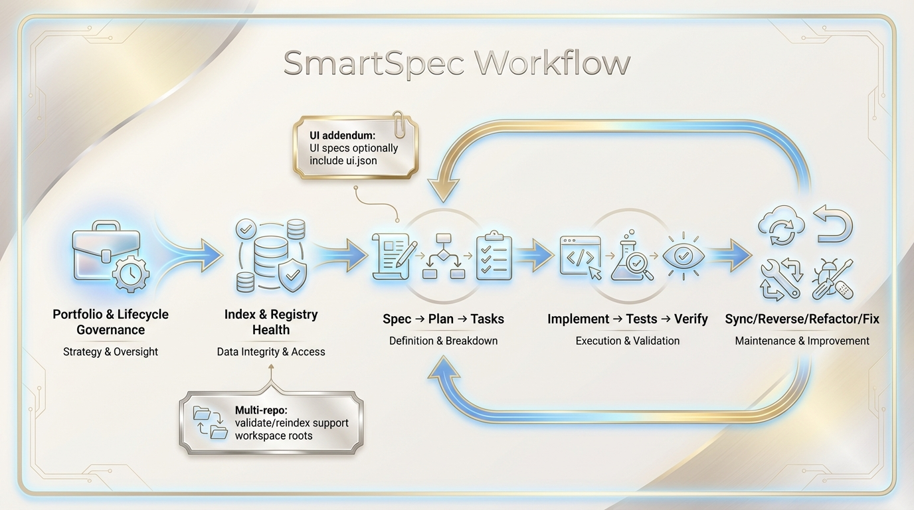
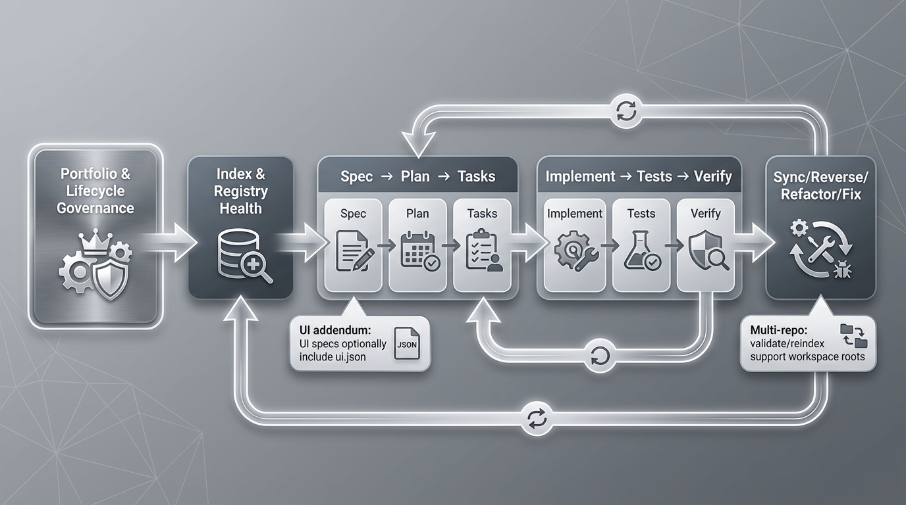

[🇬🇧 English](README.md) | [🇹🇭 ภาษาไทย](README_th.md)

---

# SmartSpec: The AI-Native Development Framework



**SmartSpec is a structured, production-grade framework that brings quality, consistency, and speed to your AI-powered development workflow.** It transforms your initial ideas into high-quality, production-ready code by orchestrating a clear, repeatable process: **SPEC → PLAN → TASKS → PROMPT → IMPLEMENT**.

---

## ✨ Supported Platforms

SmartSpec V6 supports your favorite AI coding platforms with a single-command installation:

- **Kilo Code** - For autonomous AI agent-driven development.
- **Claude Code** - For deep analysis with sub-agents.
- **Google Antigravity** - For agentic IDE with autonomous agents.
- **Gemini CLI** - For terminal-based AI coding assistant.
- **Cursor / VSCode** - For supercharging your manual "vibe coding" workflow.
- **Roo Code** - For safety-first, workflow-driven development.
---
## 🚀 New Feature: SmartSpec Copilot — Your Dedicated SmartSpec Help Assistant

# SmartSpec Copilot — Extended Overview

**SmartSpec version >6.0** introduces **SmartSpec Copilot**, an always-available interactive assistant built using OpenAI CustomGPT. It allows users to interact with SmartSpec in natural language to understand workflows, debug issues, and navigate the full SmartSpec lifecycle with far less friction.

Copilot responds in English or any language you prefer, including English,Thai,Any language.
It is now the official support channel for learning and using SmartSpec.  [**[Links]**](https://chatgpt.com/g/g-6936ffad015c81918e006a9ee2077074-smartspec-copilot)
---

## What SmartSpec Copilot Helps You Do

SmartSpec Copilot can support nearly all SmartSpec-related workflows, including:

* Installation and environment setup issues
* Understanding SmartSpec governance, lifecycle, and workflow semantics
* How to correctly perform **SPEC → PLAN → TASKS → IMPLEMENT**
* Running SmartSpec workflows in **Kilo Code**, **Claude Code**, **Google Antigravity**, or via CLI
* Fixing workflow errors, missing SPEC/TASKS files, and index problems
* Understanding design philosophy, vibe coding, and correct workflow ordering
* Choosing the correct next workflow when you're stuck

---

# Handling Repetitive Verification Loops

In real-world development, it’s common to get stuck in repeated cycles:

1. Implement tasks
2. Verify tasks
3. Verification fails
4. Re-implement
5. Verify again
6. Fail again

To break out of this cycle, SmartSpec provides a deeper troubleshooting method through the workflow:

## `/smartspec_report_implement_prompter`

This workflow analyzes the strict verification JSON report and produces **clear, structured implementation prompts**.

It creates:

* Summaries of all missing or incomplete implementation evidence
* Domain-clustered prompts (API, tests, docs, deployment, etc.)
* Highly detailed instructions optimized for AI coding assistants
* Output that can be pasted directly into **Kilo Code**, **Antigravity**, or **Claude Code**

This allows developers to resolve deep or ambiguous implementation gaps with precision.

---

# Using Generated Prompts in IDEs

After running `/smartspec_report_implement_prompter`, you can:

1. Open any generated prompt (API, testing, documentation, deployment)
2. Copy the instructions
3. Paste them into:

   * **Kilo Code**
   * **Google Antigravity**
   * **Claude Code**

These AI-based IDE copilots then perform detailed, file-level fixes that are often more accurate than relying solely on workflow automation.

Because the prompt is generated directly from strict-verification evidence, the IDE receives:

* Fully contextual problem descriptions
* Framework-aware guidance
* Exact details about missing or incomplete implementation

This dramatically reduces repeat verification failures.

---

# Alternative Method: Using SmartSpec Copilot Directly

Instead of running the implement-prompter workflow, users may also:

1. Provide SmartSpec Copilot with the strict verification report **or** describe the issue in detail.
2. Ask it to **generate an implementation-fix prompt** suitable for Kilo Code, Antigravity, or Claude Code.

SmartSpec Copilot will then:

* Interpret the report
* Identify missing evidence and unresolved tasks
* Create a polished, IDE-ready repair prompt
* Tailor instructions to detected tech stack and SmartSpec governance

This is ideal when you want a single consolidated prompt or an explanation of root causes.

---

# When to Use Which Approach?

| Situation                                     | Recommended Tool                          |
| --------------------------------------------- | ----------------------------------------- |
| Repeated strict verification failure          | `/smartspec_report_implement_prompter`    |
| Want highly structured prompts per domain     | implement-prompter                        |
| Want a combined or conversational explanation | SmartSpec Copilot                         |
| Want the deepest automated code changes       | Paste prompt into Kilo/Claude/Antigravity |

Both approaches are designed to complement each other.

---

# Final Summary

**SmartSpec Copilot** provides a natural-language interface to the entire SmartSpec workflow system.
When verification becomes repetitive or ambiguous, SmartSpec offers two powerful tools:

1. **`/smartspec_report_implement_prompter`** — Converts strict verification reports into domain-specific, accurate implementation prompts.
2. **SmartSpec Copilot (CustomGPT)** [**[Links]**](https://chatgpt.com/g/g-6936ffad015c81918e006a9ee2077074-smartspec-copilot) — Accepts reports or problem descriptions and generates refined repair prompts or explanations.

Both methods allow developers to feed precise instructions into AI-powered IDEs like **Kilo Code**, **Antigravity**, and **Claude Code**, enabling deep, accurate code repairs and significantly reducing verification loops.


Copilot responds in English or any language you prefer, including Thai.
It is now the official support channel for learning and using SmartSpec.  [**[Links]**](https://chatgpt.com/g/g-6936ffad015c81918e006a9ee2077074-smartspec-copilot)
---

## 🚀 Quick Start

### 1. Installation & Updates

**To install for the first time:**

Use the following command for your operating system.

**To update to the latest version:**

Simply run the same installation command again. The script will automatically detect your existing installation and update it to the latest version, preserving your custom workflows.

**Note:** The installation script copies workflows from `.smartspec/workflows/` (master source) to platform-specific folders (`.kilocode/workflows/`, `.roo/commands/`, `.claude/commands/`, `.agent/workflows/`, `.gemini/commands/`, etc.). For Gemini CLI, workflows are automatically converted from Markdown to TOML format. Always edit workflows in `.smartspec/workflows/` and run `.smartspec/sync.sh` to sync changes to all platforms.

**Unix / macOS / Linux:**
```bash
curl -fsSL https://raw.githubusercontent.com/naibarn/SmartSpec/main/.smartspec/scripts/install.sh | bash
```

**Windows (PowerShell):**
```powershell
irm https://raw.githubusercontent.com/naibarn/SmartSpec/main/.smartspec/scripts/install.ps1 | iex
```

### 2. The 3-Step Workflow

This is the core loop of SmartSpec. It's simple, powerful, and keeps your project on track.


---

## 🤔 Why SmartSpec? A New Paradigm for AI-Driven Development

"Vibe Coding" with AI is fast but often leads to inconsistent, low-quality results. SmartSpec provides the structure and guardrails needed for professional development without sacrificing speed.


## Vibe coding tools comparison 
[**[detail]**](.smartspec-docs/guides/vibe_coding_comparison.md)
---

## 🎯 What SmartSpec Does for Your Vibe-Coding Workflow

SmartSpec acts as a **structured engine** that transforms vibe-coding from chaotic to reliable, consistent, and production-grade. Here's how it improves your AI-powered development process:



### 1. 💡 Idea → SPEC Conversion

You provide a high-level idea or "vibe" for your project. SmartSpec generates a **complete specification** including:

- **Purpose & Goals** - What the system should achieve
- **Requirements** - Functional and non-functional requirements
- **Architecture Outline** - High-level system design
- **Constraints** - Technical limitations and boundaries
- **Domain Rules** - Business logic and validation rules

**Result:** Your vague idea becomes an engineering-ready specification.

### 2. 📋 SPEC → Plan / Tasks

SmartSpec breaks down the specification into actionable items:

- **Development Plan** - Phased implementation strategy
- **Granular Tasks** - Step-by-step work items with time estimates
- **Module Structure** - Clear file and component organization
- **Security & Performance Requirements** - Production-grade considerations

**Result:** No more "AI just writes random code" problem. You get a clear roadmap.

### 3. 🚀 Task → Implementation Prompts

SmartSpec auto-generates **high-quality prompts** that can be executed by AI coding agents:

- **"Implement Feature" Prompts** - Complete with context, requirements, and coding rules
- **"Create Component" Prompts** - With architecture guidance and best practices
- **"Refactor / Fix / Test" Prompts** - For maintenance and quality improvement

**Result:** Consistent, maintainable code across your entire project.

### 4. ✅ Auto-Validation & Governance

SmartSpec continuously checks your project for:

- **Missing Requirements** - Ensures nothing is overlooked
- **Security Gaps** - Identifies potential vulnerabilities
- **Domain Rules Compliance** - Validates business logic consistency
- **Structural Correctness** - Maintains clean architecture

**Result:** Your vibe-coding stays aligned with production standards.

### 5. 🔄 Supports Both Auto and Manual Workflows

**Auto Workflow:**
- AI implements tasks automatically
- Suitable for: Kilo Code, Claude Code, Roo Code
- Best for: Autonomous development with minimal human intervention
- SmartSpec prepares clean coding prompts
- Suitable for: Cursor, VSCode, Google Antigravity
- Best for: Interactive development with human oversight

**Result:** Both beginners and experienced developers can use SmartSpec effectively.

### 6. 🏢 Domain & Profile Support

SmartSpec includes specialized profiles for different domains:

- **CRUD Services** - Standard data management patterns
- **Backend Service Architecture** - Microservices, APIs, databases
- **Fintech / Healthcare / Enterprise** - Domain-specific rules and compliance
- **Performance + DI + Security Modes** - Production-grade patterns

**Result:** Generated specs and tasks are not generic—they adapt to your domain.

---

## 🧭 /smartspec_project_copilot – Project-Level Entry Point

`/smartspec_project_copilot` is the **recommended first command** when you open a project with SmartSpec.

Instead of starting directly from a single SPEC or workflow, this copilot acts as a **project-level navigator** that helps you:

- **Understand the current project state**  
  - Scan existing SPECs, plans, tasks, and registries.
  - Identify which parts of the SmartSpec chain are already in place.

- **Choose the right next workflow**  
  - Suggest when to run `/smartspec_generate_spec`, `/smartspec_generate_plan`, `/smartspec_generate_tasks`, or `/smartspec_implement_tasks`.
  - Help you decide between automated vs. manual / “vibe coding” flows.

- **Guide new contributors**  
  - Explain how the project is structured.
  - Point to the most relevant specs and workflows to start from.

Use it when you **don’t want to think about which command to run first** – just ask the project copilot to guide you.

👉 **Full manual:**  
See the detailed documentation in:  
[`.smartspec-docs/workflows/project_copilot_manual.md`](.smartspec-docs/workflows/project_copilot_manual.md)

---

## 🗂️ Core Workflows & Commands

SmartSpec V6 consolidates its powerful features into a streamlined set of workflows, organized by function. These commands form the backbone of the **SPEC → PLAN → TASKS → IMPLEMENT** lifecycle.

### Core Workflows

| Command | Description |
| :--- | :--- |
| [`/smartspec_generate_spec`](.smartspec-docs/workflows/generate_spec.md) | Create or refine a `spec.md` using **SPEC-first** governance. |
| [`/smartspec_generate_spec_from_prompt`](.smartspec-docs/workflows/generate_spec_from_prompt.md) | Generate **one or more starter specs** from a natural-language requirement prompt **with reuse-first intelligence**. |
| [`/smartspec_generate_plan`](.smartspec-docs/workflows/generate_plan.md) | Generate or refine `plan.md` from `spec.md` in a **dependency-aware**, **reuse-first**, **safe-by-default** way. |
| [`/smartspec_generate_tasks`](.smartspec-docs/workflows/generate_tasks.md) | Generate or refine `tasks.md` from `spec.md` (or `plan.md`) in a **verification-ready** format. |
| [`/smartspec_verify_tasks_progress_strict`](.smartspec-docs/workflows/verify_tasks_progress_strict.md) | Verify progress for a given `tasks.md` using **evidence-only checks**. |
| [`/smartspec_sync_tasks_checkboxes`](.smartspec-docs/workflows/tasks_checkboxes.md) | Synchronize `tasks.md` checkbox markers (`[x]` / `[ ]`) to match the **latest strict verification report**. |
| [`/smartspec_report_implement_prompter`](.smartspec-docs/workflows/report_implement_prompter.md) | Generate **implementation prompt packs** from a spec and tasks, optionally augmented by strict verification reports. |
| [`/smartspec_implement_tasks`](.smartspec-docs/workflows/implement_tasks.md) | Implement code changes strictly from tasks.md with SmartSpec v6 governance. |

### Project Management

| Command | Description |
| :--- | :--- |
| [`/smartspec_project_copilot`](.smartspec-docs/workflows/project_copilot_manual.md) | `/smartspec_project_copilot` is the **read-only front door** into a SmartSpec-enabled repo. |
| [`/smartspec_code_assistant`](.smartspec-docs/workflows/code_assistant.md) | A single, consolidated helper workflow that replaces the legacy trio: |

### Quality & Testing

| Command | Description |
| :--- | :--- |
| [`/smartspec_generate_tests`](.smartspec-docs/workflows/generate_tests.md) | Generate test artifacts/suggestions (prompts/scripts/reports). |
| [`/smartspec_quality_gate`](.smartspec-docs/workflows/ci_quality_gate.md) | A consolidated quality gate workflow that replaces the legacy pair: |
| [`/smartspec_test_report_analyzer`](.smartspec-docs/workflows/test_report_analyzer.md) | Analyze test results produced by `smartspec_test_suite_runner` and produce a higher-level diagnostic report: |
| [`/smartspec_test_suite_runner`](.smartspec-docs/workflows/test_suite_runner.md) | Execute a project's test suite (e.g., Jest, Vitest, Cypress) and generate a standardized SmartSpec report. |

### Security & Audit

| Command | Description |
| :--- | :--- |
| [`/smartspec_security_audit_reporter`](.smartspec-docs/workflows/security_audit_reporter.md) | Generate a security audit report by correlating identified threats in `threats.md` with mitigation evidence in `tasks.md`, **validated against stri... |
| [`/smartspec_security_threat_modeler`](.smartspec-docs/workflows/security_threat_modeler.md) | To automatically generate a preliminary threat model and a `threats.md` artifact by analyzing `spec.md` and `plan.md`. This workflow helps identify... |
| [`/smartspec_api_contract_validator`](.smartspec-docs/workflows/api_contract_validator.md) | Validate an API implementation against its defined contract (**OpenAPI v3 primary; GraphQL schema supported in limited mode—see Contract parsing ru... |
| [`/smartspec_data_model_validator`](.smartspec-docs/workflows/data_model_validator.md) | Validate that an application's data model (ORM models / schema files / migrations) is consistent with the data model described in a SmartSpec `spec... |
| [`/smartspec_ui_component_audit`](.smartspec-docs/workflows/ui_component_audit.md) | Audit frontend source code against a defined Design System, focusing on: |

### Documentation

| Command | Description |
| :--- | :--- |
| [`/smartspec_docs_generator`](.smartspec-docs/workflows/docs_generator.md) | Generate technical documentation from specs and code. |
| [`/smartspec_docs_publisher`](.smartspec-docs/workflows/docs_publisher.md) | Publish documentation to various platforms. |

### Operations & Deployment

| Command | Description |
| :--- | :--- |
| [`/smartspec_deployment_planner`](.smartspec-docs/workflows/deployment_planner.md) | Generate deployment plans and checklists. |
| [`/smartspec_hotfix_assistant`](.smartspec-docs/workflows/hotfix_assistant.md) | Assist in creating and managing hotfixes. |
| [`/smartspec_release_tagger`](.smartspec-docs/workflows/release_tagger.md) | Manage release tags and versioning. |
| [`/smartspec_data_migration_generator`](.smartspec-docs/workflows/data_migration_generator.md) | To automate the creation of draft Data Migration scripts based on the discrepancies identified by `/smartspec_data_model_validator`. This workflow ... |
| [`/smartspec_observability_configurator`](.smartspec-docs/workflows/observability_configurator.md) | Configure observability tools (logging, metrics, tracing). |

### NFR & Performance

| Command | Description |
| :--- | :--- |
| [`/smartspec_nfr_perf_planner`](.smartspec-docs/workflows/nfr_perf_planner.md) | Produce NFR/performance plan from spec (reports). |
| [`/smartspec_nfr_perf_verifier`](.smartspec-docs/workflows/nfr_perf_verifier.md) | Verify NFR/performance evidence (reports). |

### UI & Design

| Command | Description |
| :--- | :--- |
| [`/smartspec_ui_validation`](.smartspec-docs/workflows/ui_validation_manual.md) | A single UI audit workflow that supports two modes: |
| [`/smartspec_design_system_migration_assistant`](.smartspec-docs/workflows/design_system_migration_assistant.md) | Assist a controlled migration from one UI component library / design token system to another by generating **deterministic patches** and **risk-sco... |

### Index Management

| Command | Description |
| :--- | :--- |
| [`/smartspec_reindex_specs`](.smartspec-docs/workflows/reindex_specs.md) | Refresh the canonical spec registry: |
| [`/smartspec_reindex_workflows`](.smartspec-docs/workflows/smartspec_reindex_workflows.md) | Refresh the canonical workflow registry: |
| [`/smartspec_validate_index`](.smartspec-docs/workflows/validate_index.md) | Validate SmartSpec registries and contracts: |

## 🎨 UI Design (Penpot JSON-First in roadmap)

SmartSpec supports a dedicated UI track designed for teams who manage UI/UX in design tools
and want a reliable bridge to implementation in code.


UI Design separates the UI layer from various components. This means the UI is built from existing components, helping prevent issues where editing the UI affects other parts of the code.

Supports working with Penpot. However, because Penpot uses a specific JSON format, standard JSON cannot be used with Penpot directly. Therefore, a conversion tool is needed (**this is on the roadmap and not yet completed**).

Key principles:
- **`ui.json` is the design source of truth** for UI-category specs (Penpot-editable).
- **No business logic in `ui.json`.** Logic lives in code and is described in `spec.md` where needed.
- UI tasks should be split into three explicit tracks:
  1) Design (UI team / Penpot)
  2) Component binding (Penpot → code)
  3) Logic (dev team)
- Optional shared registry for stable cross-SPEC naming:
  - `.spec/registry/ui-component-registry.json`

If your project does not use UI JSON yet, the recommended approach is **legacy-friendly migration**:
tools should warn and emit optional migration tasks rather than fail hard.

- **[SmartSpec UI Guide - more detail](.smartspec-docs/guides/SMARTSPEC_UI_GUIDE.md)**


## 🏛️ Architecture Overview

SmartSpec acts as an orchestration layer, separating the specification and planning phase from the code implementation phase. This ensures all development work is grounded in a clear, agreed-upon blueprint.


---

## 🧩 Advanced Features

SmartSpec is more than just a workflow; it's a complete orchestration system with features designed for enterprise-grade projects.


---

## 🏛️ For the LLM

**Repository Goal:** This repository contains the SmartSpec framework, an AI-native development methodology. Your primary goal is to understand its workflows and commands to assist users.

**Key Files:**
- `README.md`: High-level overview.
- `.smartspec-docs/workflows/`: Detailed documentation for each command. This is your **primary source of truth** for command usage, parameters, and examples.
- `.smartspec/workflows/`: The master workflow definitions. **Always edit workflows here, not in platform-specific folders.**

When a user asks how to use a command, first consult the corresponding file in `.smartspec-docs/workflows/` to provide a detailed, accurate answer.

---

## 🎓 Learning & Support

- **[Troubleshooting Guide](.smartspec-docs/guides/troubleshooting.md)** - Solve common errors and issues.


---

## 📝 Troubleshooting

For common issues and solutions, see the **[Troubleshooting Guide](.smartspec-docs/guides/troubleshooting.md)**.

## 📝 Release Notes

Detailed changes for each version are tracked in:

- **[v6.0 Release Notes](.smartspec-docs/release-notes/RELEASE_NOTES_v6.0.md)** (New)
- **[v5.7 Release Notes](.smartspec-docs/release-notes/smart_spec_release_notes_v_5_7.md)**
- **[v5.6 Release Notes](.smartspec-docs/release-notes/smartspec_v_56_release_notes_en.md)**
- **[v5.2 Release Notes](.smartspec-docs/release-notes/RELEASE_NOTES_v5.2.md)**

Future releases should add new files under `.smartspec-docs/release-notes/` and link them here. under `.smartspec-docs/release-notes/` and link them here. under `.smartspec-docs/release-notes/` and link them here.
