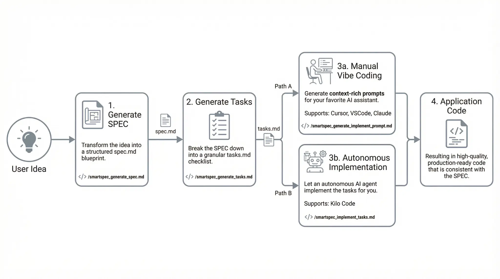
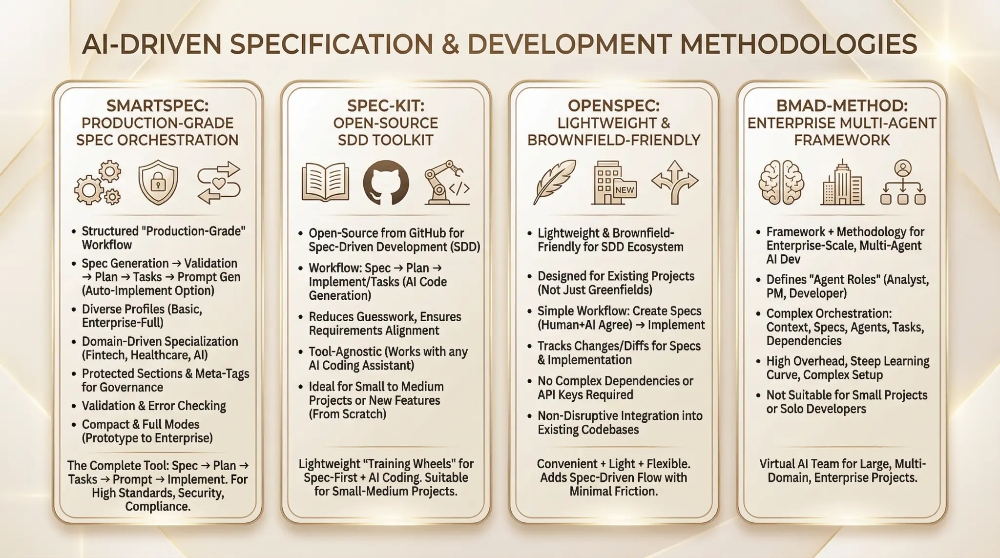
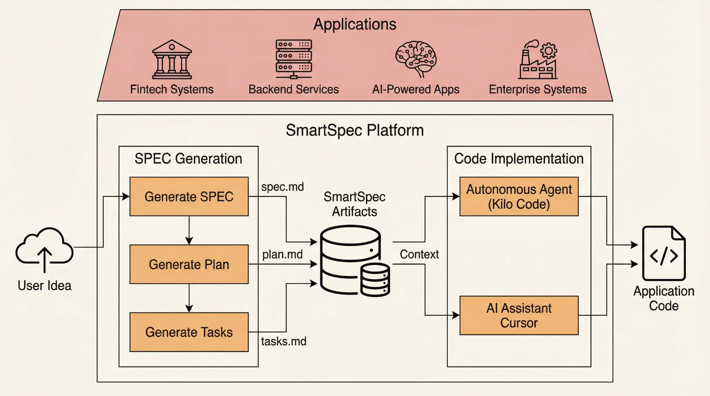
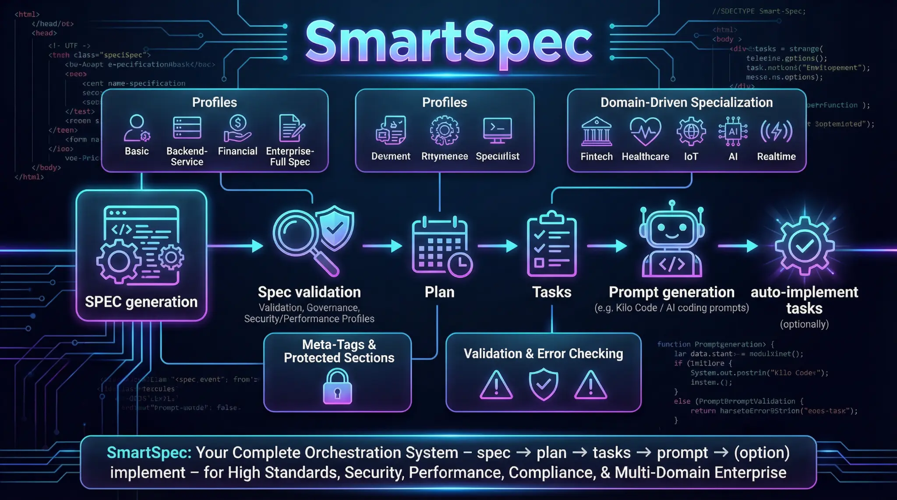

# SmartSpec: The AI-Native Development Framework


**SmartSpec is a structured, production-grade framework that brings quality, consistency, and speed to your AI-powered development workflow.** It transforms your initial ideas into high-quality, production-ready code by orchestrating a clear, repeatable process: **SPEC → PLAN → TASKS → PROMPT → IMPLEMENT**.

---

## ✨ Supported Platforms

SmartSpec V5 supports your favorite AI coding platforms with a single-command installation:

- **Kilo Code** - For autonomous AI agent-driven development.
- **Claude Code** - For deep analysis with sub-agents.
- **Cursor / VSCode / Google Antigravity** - For supercharging your manual "vibe coding" workflow.
- **Roo Code** - For safety-first, workflow-driven development.

---

## 🚀 Quick Start

### 1. Installation & Updates

**To install for the first time:**

Use the following command for your operating system.

**To update to the latest version:**

Simply run the same installation command again. The script will automatically detect your existing installation and update it to the latest version, preserving your custom workflows.

**Note:** The installation script copies workflows from `.smartspec/workflows/` (master source) to platform-specific folders (`.kilocode/workflows/`, `.roo/commands/`, etc.). Always edit workflows in `.smartspec/workflows/` and run `.smartspec/sync.sh` to sync changes to all platforms.

**Unix / macOS / Linux:**
```bash
curl -fsSL https://raw.githubusercontent.com/naibarn/SmartSpec/main/.smartspec/scripts/install.sh | bash
```

**Windows (PowerShell):**
```powershell
irm https://raw.githubusercontent.com/naibarn/SmartSpec/main/.smartspec/scripts/install.ps1 | iex
```

### 2. The 3-Step Workflow

This is the core loop of SmartSpec. It's simple, powerful, and keeps your project on track.



---

## 🤔 Why SmartSpec? A New Paradigm for AI-Driven Development

"Vibe Coding" with AI is fast but often leads to inconsistent, low-quality results. SmartSpec provides the structure and guardrails needed for professional development without sacrificing speed.



---

## 📖 Core Commands

Each command corresponds to a workflow that you can customize. Click on a command to see its detailed documentation.

| Command | Description | Full Docs |
| :--- | :--- | :--- |
| `/smartspec_generate_spec.md` | Create a structured SPEC from an idea. | [**[Details]**](.smartspec-docs/workflows/generate_spec.md) |
| `/smartspec_generate_plan.md` | Generate a high-level implementation plan. | [**[Details]**](.smartspec-docs/workflows/generate_plan.md) |
| `/smartspec_generate_tasks.md` | Break the plan into granular tasks. | [**[Details]**](.smartspec-docs/workflows/generate_tasks.md) |
| `/smartspec_generate_implement_prompt.md` | Create context-rich prompts for AI assistants. | [**[Details]**](.smartspec-docs/workflows/generate_implement_prompt.md) |
| `/smartspec_generate_cursor_prompt.md` | Generate user-friendly prompts for Cursor/Antigravity. | [**[Details]**](.smartspec-docs/workflows/generate_cursor_prompt.md) |
| `/smartspec_implement_tasks.md` | Execute tasks with an autonomous agent. | [**[Details]**](.smartspec-docs/workflows/implement_tasks.md) |
| `/smartspec_reverse_to_spec.md` | Reverse-engineer code into a SPEC. | [**[Details]**](.smartspec-docs/workflows/reverse_to_spec.md) |
| `/smartspec_sync_spec_tasks.md` | Sync changes between SPEC and tasks. | [**[Details]**](.smartspec-docs/workflows/sync_spec_tasks.md) |
| `/smartspec_verify_tasks_progress.md` | Verify task completion and code quality. | [**[Details]**](.smartspec-docs/workflows/verify_tasks_progress.md) |

---

### Choosing the Right Prompt Generation Workflow

SmartSpec offers two distinct commands for generating prompts, each tailored for a different execution model. Understanding the difference is key to a smooth workflow.

| Feature | `/generate_implement_prompt` | `/generate_cursor_prompt` |
| :--- | :--- | :--- |
| **Target Platform** | **Kilo Code, Roo Code, Claude Code** | **Cursor, Google Antigravity** |
| **Execution Model** | 🤖 **Automated Execution** | 🧑‍💻 **Manual Copy/Paste** |
| **User Action** | Run `kilocode execute "<file>"` or `roo run "<file>"` | Copy each prompt section and paste it into the AI assistant. |
| **Output Format** | **One continuous document** with all context. | **One file with multiple, distinct prompt sections.** |
| **Prompt Philosophy** | Written for an **AI Agent** to execute autonomously. | Written for a **Human Developer** to guide an AI assistant. |
| **Best Use Case** | Implementing a sequence of related tasks in a single, powerful session. | Implementing tasks one-by-one in an interactive, "vibe coding" session. |
| **Analogy** | Giving a detailed project brief to a senior developer. | Writing a clear to-do list for a junior developer. |

**In short:** Use `generate_implement_prompt` for automated platforms and `generate_cursor_prompt` for interactive, manual coding.

---

## 🏛️ Architecture Overview

SmartSpec acts as an orchestration layer, separating the specification and planning phase from the code implementation phase. This ensures all development work is grounded in a clear, agreed-upon blueprint.



---

## 🧩 Advanced Features

SmartSpec is more than just a workflow; it's a complete orchestration system with features designed for enterprise-grade projects.



---

## 🏛️ For the LLM

**Repository Goal:** This repository contains the SmartSpec framework, an AI-native development methodology. Your primary goal is to understand its workflows and commands to assist users.

**Key Files:**
- `README.md`: High-level overview.
- `.smartspec-docs/workflows/`: Detailed documentation for each command. This is your **primary source of truth** for command usage, parameters, and examples.
- `.smartspec/workflows/`: The master workflow definitions. **Always edit workflows here, not in platform-specific folders.**

When a user asks how to use a command, first consult the corresponding file in `.smartspec-docs/workflows/` to provide a detailed, accurate answer.

---

## 🎓 Learning & Support

- **[Troubleshooting Guide](.smartspec-docs/guides/troubleshooting.md)** - Solve common errors and issues.

---

## Troubleshooting

**Command not found:**
- Ensure the installation script ran correctly and that `~/.smartspec/bin` is in your shell's `PATH`.
- Restart your terminal or source your shell profile file (e.g., `source ~/.zshrc`).
